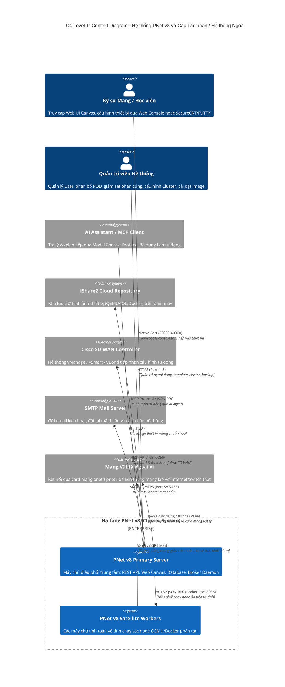

# TỔNG QUAN HỆ THỐNG PNET V8 (PNETLAB V8)

## 1. Giới thiệu & Bài toán Nghiệp vụ

### 1.1. PNet v8 là gì?
**PNet v8** (tên thương mại: **PNETLab v8**, phát triển kế thừa và mở rộng từ nền tảng UNetLab / EVE-NG) là một **Hệ thống Giả lập Hạ tầng Mạng Phân tán Doanh nghiệp (Enterprise Distributed Network Emulation Platform)** chạy trên nền Linux (Ubuntu/Debian). 

Hệ thống cho phép các kỹ sư mạng, chuyên gia bảo mật, giảng viên và học viên xây dựng, cấu hình, kiểm thử và vận hành các topo mạng viễn thông phức tạp với hàng trăm thiết bị ảo hóa từ nhiều nhà sản xuất khác nhau (Cisco, Juniper, Arista, Fortinet, Check Point, Palo Alto, Huawei, Linux, Windows...) trên một giao diện đồ họa Web duy nhất.

### 1.2. Bài toán Nghiệp vụ Giải quyết
1. **Loại bỏ sự phụ thuộc vào phần cứng vật lý đắt đỏ**: Thay vì đầu tư hàng tỷ đồng mua router, switch, firewall vật lý, PNet v8 cho phép ảo hóa chính xác hệ điều hành mạng thật (Cisco IOS, IOS-XE, IOS-XR, NX-OS, JunOS, vEOS, FortiOS) bằng KVM/QEMU, Cisco IOL (IOS-on-Linux) và Docker.
2. **Kiểm thử thay đổi cấu hình không rủi ro (Risk-Free Staging)**: Thử nghiệm kịch bản nâng cấp mạng, chuyển đổi giao thức định tuyến (BGP, OSPF, SRv6, EVPN-VXLAN) trước khi triển khai thực tế trên mạng sống (production).
3. **Đào tạo, Chứng chỉ & Chấm thi tự động**: Cung cấp môi trường lab thực hành mạng kèm hệ thống đánh giá tự động (Automated Validation Probe) chấm điểm kết quả cấu hình theo kịch bản có sẵn.
4. **Mở rộng tài nguyên tính toán theo chiều ngang (Horizontal Scaling)**: Giải quyết giới hạn phần cứng của 1 máy chủ đơn lẻ bằng kiến trúc **Cluster Master - Satellite**, cho phép gom nhiều máy chủ vật lý thành một cụm tính toán duy nhất.
5. **Mô phỏng điều kiện mạng thực tế (Network Impairment)**: Giả lập đường truyền quốc tế với độ trễ (delay), rung giật (jitter), mất gói (loss), suy giảm băng thông (bandwidth throttle) theo thời gian thực nhờ Linux Kernel NetEm.
6. **Tích hợp Tự động hóa & Trợ lý Trí tuệ nhân tạo (AI Lab Agent)**: Cung cấp giao thức **Model Context Protocol (MCP)** và API REST để các AI Agent (LLM) hoặc pipeline CI/CD có thể tự động sinh topo, nạp cấu hình và chẩn đoán sự cố mạng.

---

## 2. Kiến trúc Tổng thể Hệ thống

PNet v8 áp dụng kiến trúc **Hỗn hợp Hướng Dịch vụ (Service-Oriented Hybrid Architecture)** kết hợp giữa Web Monolith (PHP Slim REST API), hệ thống Micro-Daemons nền (Python asyncio & Node.js), tầng Wrapper nhị phân C/C++ trực tiếp điều khiển Linux Kernel Virtualization, và tầng xử lý phân tán qua Cluster Satellite.

---

## 3. Ngăn xếp Công nghệ (Technology Stack)

Toàn bộ hệ thống được xây dựng trên stack công nghệ phân lớp sâu:

| Tầng chức năng | Công nghệ / Thư viện sử dụng | Vai trò trong hệ thống |
| :--- | :--- | :--- |
| **Hệ điều hành nền** | Linux Kernel 5.x / 6.x (Ubuntu Server 20.04/22.04 LTS) | Cung cấp KVM, Network Namespaces, veth, Bridge, TC (Traffic Control), Cgroups v1/v2, KSM |
| **Web Server & Reverse Proxy** | Apache HTTP Server 2.4 (mod_php, mod_proxy, mod_proxy_wstunnel) | Phục vụ giao diện tĩnh, định tuyến REST API, chuyển tiếp WebSocket bridge |
| **Tầng Backend API** | PHP 7.4 / 8.x + Slim Framework v2 / v3 + PDO MySQL | Xử lý nghiệp vụ Web, xác thực quyền, tương tác cơ sở dữ liệu và gọi CLI wrappers |
| **Cơ sở dữ liệu** | MariaDB / MySQL 8.0 (`pnetlab_db`, `guacdb`) | Lưu trữ người dùng, quyền POD, phiên lab, thông số cluster, cấu hình Guacamole |
| **Console Web HTML5** | Apache Guacamole Lite (Node.js) + Python WebSocket Multiplexer | Cung cấp terminal Telnet/SSH/Serial và màn hình đồ họa VNC/RDP ngay trên trình duyệt |
| **Các Daemon nền (Daemons)** | Python 3 (asyncio, socket, threading, scapy, paramiko) | `pnetlab-brokerd` (Cluster), `pnetlab-labstated` (Live SSE), `pnetlab-linkwatchd` (NetEm), `pnq-telemetryd` (Thống kê) |
| **Tầng Ảo hóa & Wrapper** | QEMU/KVM, Cisco IOL, Dynamips, Docker CE, VPCS, C binary wrappers | `qemu_wrapper`, `iol_wrapper`, `docker_wrapper`, `dynamips_wrapper`, `simple_forwarder` |
| **Giao diện Người dùng (Frontend)**| Vanilla JavaScript (ES6+), HTML5 Canvas, EJS Templates, Ace Editor | Render bản đồ mạng mượt mà, kéo thả linh kiện, vẽ luồng gói tin, chỉnh sửa file cấu hình |
| **Trí tuệ nhân tạo (AI)** | Model Context Protocol (MCP) Server, Python AI Agent Bridge | Cho phép LLM can thiệp vào canvas lab theo thời gian thực |
| **Bảo mật & Mã hóa** | OpenSSL, mTLS, X.509 PKI, Argon2i/Bcrypt | Mã hóa xác thực giữa Master và Satellite, bảo vệ phiên đăng nhập người dùng |

---

## 4. Danh mục 12 Nhóm Tính năng Toàn diện (Level 1 Directory)

Dưới đây là 12 nhóm tính năng cốt lõi bao phủ 100% mã nguồn PNet v8. Mỗi nhóm tính năng được đặc tả tại một tài liệu riêng ở thư mục `01-feature-groups/`:

| Nhóm | Tên Nhóm Tính Năng | File Tài Liệu Level 1 | Số lượng Tính năng Con (Level 2) | Tóm tắt Chức năng |
| :---: | :--- | :--- | :---: | :--- |
| **G01** | **Động cơ Giả lập & Quản lý Vòng đời Node** | [`01-node-lifecycle-emulation.md`](01-feature-groups/01-node-lifecycle-emulation.md) | 7 | Cấp phát, khởi động, dừng, wipe, xuất cấu hình và quản lý tiến trình QEMU/IOL/Docker |
| **G02** | **Mạng kết nối, Topo & Canvas Đồ họa** | [`02-network-topology-canvas.md`](01-feature-groups/02-network-topology-canvas.md) | 7 | Kéo thả topo, vẽ dây nối, mạng Bridge/Cloud pnet, hình khối khối chữ nhật/tròn, hình nền |
| **G03** | **Bàn điều khiển & Truy cập Từ xa** | [`03-console-remote-access.md`](01-feature-groups/03-console-remote-access.md) | 5 | WebConsole Telnet/SSH, HTML5 VNC/RDP Guacamole, Token bảo mật, bắt Wireshark từ xa |
| **G04** | **Quản lý Lab, Import/Export & Phân quyền Lab** | [`04-lab-management-collaboration.md`](01-feature-groups/04-lab-management-collaboration.md) | 6 | Cấu trúc cây thư mục, format file XML UNL, Import/Export ZIP, đổi đuôi CML/VIRL, Lab Lock |
| **G05** | **Cụm phân tán Cluster & Vệ tinh (Satellite)** | [`05-cluster-distributed-satellite.md`](01-feature-groups/05-cluster-distributed-satellite.md) | 5 | Broker Daemon `pnetlab-brokerd`, Satellite Join, điều phối Node placement, đồng bộ VXLAN |
| **G06** | **Giả lập Sự cố Mạng (NetEm) & Giám sát Thời gian thực** | [`06-netem-telemetry-monitoring.md`](01-feature-groups/06-netem-telemetry-monitoring.md) | 6 | NetEm Delay/Loss/Jitter, Link Watcher, giám sát CPU/RAM qua Cgroups, Egress Link Glow |
| **G07** | **Phân tích Giao thức & Lớp phủ Trực quan (Overlay)** | [`07-protocol-overlay-analytics.md`](01-feature-groups/07-protocol-overlay-analytics.md) | 7 | Lớp phủ BGP/OSPF/ISIS, BGP Waterfall, Prototracer giải mã gói tin, vWiFi 802.11, Rack View |
| **G08** | **Thẩm định & Chấm điểm Lab Tự động** | [`08-lab-validation-assessment.md`](01-feature-groups/08-lab-validation-assessment.md) | 4 | Động cơ kiểm tra bài thi mạng, chạy probe Telnet/SSH, lưu kết quả và chấm điểm tự động |
| **G09** | **Quản lý Image, Template Thiết bị & Kho Ứng dụng** | [`09-device-templates-images.md`](01-feature-groups/09-device-templates-images.md) | 6 | Device Template YAML/PHP, Device Factory tùy biến, kho IShare2 Cloud, chuẩn hóa QCOW2 |
| **G10** | **Tự động hóa, Trợ lý AI (MCP) & Cisco SD-WAN** | [`10-automation-ai-sdwan.md`](01-feature-groups/10-automation-ai-sdwan.md) | 5 | Trợ lý ảo MCP Server `pnetlab-mcp.py`, dựng lab bằng AI, tự động nạp cấu hình Cisco SD-WAN |
| **G11** | **Quản lý Người dùng, Phân quyền POD & Bảo mật PKI** | [`11-user-security-pki.md`](01-feature-groups/11-user-security-pki.md) | 5 | Cách ly đa người dùng qua POD, RBAC, cấp phát chứng chỉ số PKI, SMTP Mailer, Cookie Token |
| **G12** | **Quản trị Hệ thống, Nền tảng & Doctor** | [`12-system-diagnostics-platform.md`](01-feature-groups/12-system-diagnostics-platform.md) | 6 | Hệ thống tự chẩn đoán lỗi PNet Doctor, KSM Memory Dedup, kịch bản khởi tạo mạng OVF |

---

## 5. Bảng Thuật ngữ Dành cho Lập trình viên Mới (Glossary)

Để giúp thành viên mới tiếp cận dự án nhanh nhất, dưới đây là giải thích ngắn gọn các thuật ngữ đặc thù trong codebase PNet v8:

- **POD (Point of Delivery / User Pod)**: Mã số định danh không gian làm việc của người dùng (từ `0` đến `128`). Mỗi người dùng khi khởi động một lab sẽ được phân bổ vào một Tenant ID = POD, đảm bảo file tạm và port mạng không bị xung đột với người khác.
- **Node**: Một thực thể thiết bị mạng ảo (Router, Switch, Firewall, Server, PC).
- **Network / Cloud**: Đối tượng kết nối mạng. Có 2 dạng: mạng cục bộ giả lập giữa các node (Bridge / Point-to-Point) hoặc mạng Cloud nối ra ngoài vật lý (`pnet0` nối card mạng chính, `pnet1-pnet9` nối các VLAN card mạng phụ).
- **Wrapper**: Tiến trình nhị phân viết bằng C/C++ (`qemu_wrapper`, `iol_wrapper`...) chạy dưới quyền root (setuid) để can thiệp trực tiếp vào nhân Linux, khởi chạy QEMU hoặc IOL và gán card mạng TAP vào Linux Bridge.
- **Satellite**: Một máy chủ vật lý phụ trợ được kết nối vào máy chủ chính (Master) để gánh tải RAM/CPU cho các node nặng mà không cần cấu hình phức tạp.
- **Startup-config**: File chứa nội dung cấu hình khởi động của thiết bị (ví dụ `startup-config` của Cisco IOS), được PNet v8 tự động nạp vào NVRAM khi node khởi động.
- **Wipe (Làm sạch Node)**: Thao tác xóa phân vùng ghi tạm (`overlay disk`, file NVRAM) để đưa thiết bị trở về cấu hình mặc định ban đầu của image gốc.
- **NetEm (Network Emulation)**: Module trong nhân Linux cho phép can thiệp vào hàng đợi gói tin (`qdisc`) để cố tình tạo ra độ trễ (delay), mất gói (loss), sai thứ tự gói tin (reorder) nhằm mô phỏng mạng WAN thực tế.
- **IShare2**: Hệ thống kho ứng dụng đám mây tích hợp trong PNet, cho phép tải các bản cài đặt thiết bị mạng đã đóng gói sẵn chỉ bằng 1 click chuột.
- **MCP (Model Context Protocol)**: Giao thức mở cho phép các mô hình ngôn ngữ lớn (LLM/AI) truy vấn dữ liệu ngữ cảnh và thực hiện hành động trên PNet v8.

---

> 👉 **Bước tiếp theo**: Xem tài liệu phân rã chi tiết của 12 nhóm tính năng tại thư mục [`01-feature-groups/`](01-feature-groups/).
