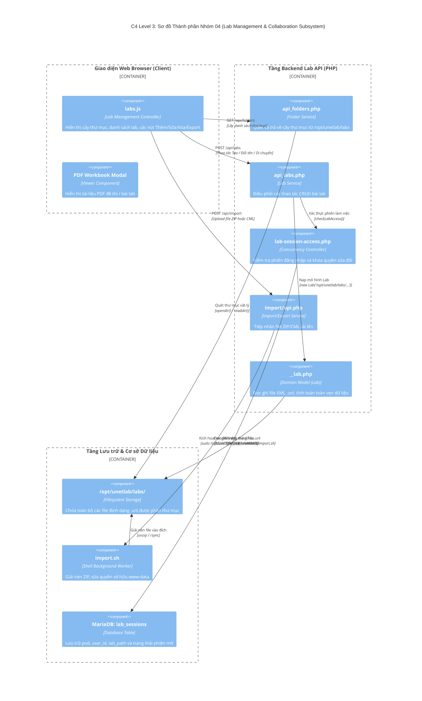

# NHÓM 04: QUẢN LÝ LAB, IMPORT/EXPORT & PHÂN QUYỀN LAB (LAB MANAGEMENT & COLLABORATION SUBSYSTEM)

## 1. Mục đích của Nhóm Tính năng

Nhóm **Quản lý Lab, Import/Export & Phân quyền Lab** đảm nhiệm việc tổ chức, lưu trữ, trao đổi và kiểm soát quyền truy cập đối với các bài thực hành (Lab Files) trong hệ thống PNet v8:
1. **Cấu trúc Cây Thư mục & Quản lý Tệp Lab (File Tree & CRUD Labs)**: Cho phép tổ chức các bài lab theo cấu trúc thư mục lồng nhau không giới hạn cấp độ; thực hiện các thao tác Tạo mới, Xem chi tiết, Đổi tên, Di chuyển (Move/Cut/Paste), Sao chép (Clone) và Xóa lab an toàn.
2. **Bộ Xử lý Định dạng UNetLab XML (XML Serializer & Parser)**: Đọc và ghi toàn bộ cấu trúc dữ liệu của một bài lab (thông số lab, danh sách node, danh sách mạng kết nối, tọa độ dây nối, hình khối, ghi chú, cấu hình ban đầu) vào định dạng chuẩn `.unl` (XML schema).
3. **Đóng gói & Trao đổi Lab (Zip Export & Import)**: Xuất toàn bộ bài lab cùng toàn bộ hình ảnh minh họa, file startup-config và tài liệu workbook thành một tệp nén `.zip` độc lập; hỗ trợ nhập khẩu (Import) lab vào hệ thống tự động giải nén và phân quyền.
4. **Bộ Chuyển đổi Khả chuyển Định dạng (CML/VIRL Converter)**: Tự động chuyển đổi các bài lab được thiết kế từ phần mềm Cisco Modeling Labs (CML / VIRL) sang định dạng `.unl` của PNet v8 để tái sử dụng tài nguyên học liệu.
5. **Kiểm soát Truy cập & Khóa Phiên Lab Đồng thời (Lab Locking & Concurrency Control)**: Ngăn chặn xung đột ghi đè dữ liệu khi nhiều người dùng cùng mở một bài lab bằng cơ chế cờ khóa `F-LOCK` và quản lý phiên trong bảng `lab_sessions`.
6. **Trình đọc Tài liệu Lab Tích hợp (Integrated Workbook Viewer)**: Nhúng trình xem file hướng dẫn thực hành (PDF Workbook / Markdown Guide) ngay bên cạnh Canvas để học viên vừa đọc đề bài vừa thao tác thiết bị.

---

## 2. Danh sách Toàn bộ Tính năng Con Thuộc Nhóm (Dẫn tới Level 2)

Dưới đây là 6 tính năng con độc lập thuộc Nhóm 04, được đặc tả chi tiết tại thư mục `02-features/lab-management/`:

| Mã tính năng | Tên tính năng con | File tài liệu Level 2 | Tóm tắt Chức năng |
| :---: | :--- | :--- | :--- |
| **F20** | **Quản lý Cây Thư mục & Thao tác Lab (Lab & Folder CRUD)** | [`F20-lab-crud-tree.md`](../02-features/lab-management/F20-lab-crud-tree.md) | Thêm, sửa, xóa, di chuyển cây thư mục và tệp lab `.unl` trong thư mục `/opt/unetlab/labs` |
| **F21** | **Bộ Đọc & Ghi Cấu trúc Lab XML (XML Serializer & Parser)** | [`F21-lab-xml-parser-serializer.md`](../02-features/lab-management/F21-lab-xml-parser-serializer.md) | Phân tích cú pháp XML, chuyển đổi sang đối tượng PHP `Lab` và tuần tự hóa ngược lại XML an toàn |
| **F22** | **Đóng gói & Nhập Xuất Lab (ZIP Export & Import)** | [`F22-lab-export-import-zip.md`](../02-features/lab-management/F22-lab-export-import-zip.md) | Đóng gói file `.unl` cùng các tài sản đính kèm (pictures, startup-configs) thành file ZIP và ngược lại |
| **F23** | **Bộ Chuyển đổi Lab Cisco CML / VIRL (Format Converter)** | [`F23-lab-cml-virl-converter.md`](../02-features/lab-management/F23-lab-cml-virl-converter.md) | Phân tích cú pháp YAML/XML của Cisco CML, chuyển đổi các node Cisco và interface mapping sang PNet |
| **F24** | **Khóa Phiên & Kiểm soát Đồng thời (Lab Session Locking)** | [`F24-lab-session-locking.md`](../02-features/lab-management/F24-lab-session-locking.md) | Kiểm soát quyền sửa đổi qua cờ `lock`, theo dõi phiên người dùng đang mở trong bảng `lab_sessions` |
| **F25** | **Trình Xem Tài liệu Thực hành (Integrated Workbook Viewer)** | [`F25-lab-workbook-pdf.md`](../02-features/lab-management/F25-lab-workbook-pdf.md) | Xem tài liệu bài tập PDF và tài liệu markdown trực tiếp bên cạnh màn hình Canvas lab |

---

## 3. Các Module & File Mã nguồn Chịu trách nhiệm Chính

| Đường dẫn File / Thư mục | Ngôn ngữ / Loại | Vai trò chính |
| :--- | :--- | :--- |
| `/opt/unetlab/html/includes/api_labs.php` | PHP | Nghiệp vụ chính: `apiLabAdd()`, `apiLabEdit()`, `apiLabDelete()`, `apiLabGet()`, `apiLabMove()` |
| `/opt/unetlab/html/includes/api_folders.php` | PHP | Quản lý thư mục: `apiFolderGet()`, `apiFolderAdd()`, `apiFolderEdit()`, `apiFolderDelete()` |
| `/opt/unetlab/html/includes/__lab.php` | PHP (OOP) | Domain Object `Lab` (100KB code): Quản lý toàn bộ cấu trúc dữ liệu XML của bài lab, nạp/lưu nodes, networks, textobjects |
| `/opt/unetlab/html/includes/lab-session-access.php` | PHP | Kiểm tra phiên làm việc và quyền sửa đổi bài lab của người dùng |
| `/opt/unetlab/html/import/api.php` | PHP | API tiếp nhận file tải lên, xác thực định dạng và gọi script chuyển đổi |
| `/opt/unetlab/scripts/workers/import.sh` | Shell Script | Script nền giải nén, thiết lập quyền phân phối và di chuyển lab vào thư mục hệ thống |
| `/opt/unetlab/html/main/js/labs.js` | JavaScript | Giao diện quản lý danh sách lab, cây thư mục, dialog tạo mới và chọn thao tác |

---

## 4. Sơ đồ Component Diagram (C4 Level 3: Lab Management Subsystem)

---

> 👉 **Xem chi tiết từng tính năng con**:
> 1. [`F20-lab-crud-tree.md`](../02-features/lab-management/F20-lab-crud-tree.md) — Quản lý Cây Thư mục & Thao tác Lab (Lab & Folder CRUD)
> 2. [`F21-lab-xml-parser-serializer.md`](../02-features/lab-management/F21-lab-xml-parser-serializer.md) — Bộ Đọc & Ghi Cấu trúc Lab XML (XML Serializer & Parser)
> 3. [`F22-lab-export-import-zip.md`](../02-features/lab-management/F22-lab-export-import-zip.md) — Đóng gói & Nhập Xuất Lab (ZIP Export & Import)
> 4. [`F23-lab-cml-virl-converter.md`](../02-features/lab-management/F23-lab-cml-virl-converter.md) — Bộ Chuyển đổi Lab Cisco CML / VIRL (Format Converter)
> 5. [`F24-lab-session-locking.md`](../02-features/lab-management/F24-lab-session-locking.md) — Khóa Phiên & Kiểm soát Đồng thời (Lab Session Locking)
> 6. [`F25-lab-workbook-pdf.md`](../02-features/lab-management/F25-lab-workbook-pdf.md) — Trình Xem Tài liệu Thực hành (Integrated Workbook Viewer)
