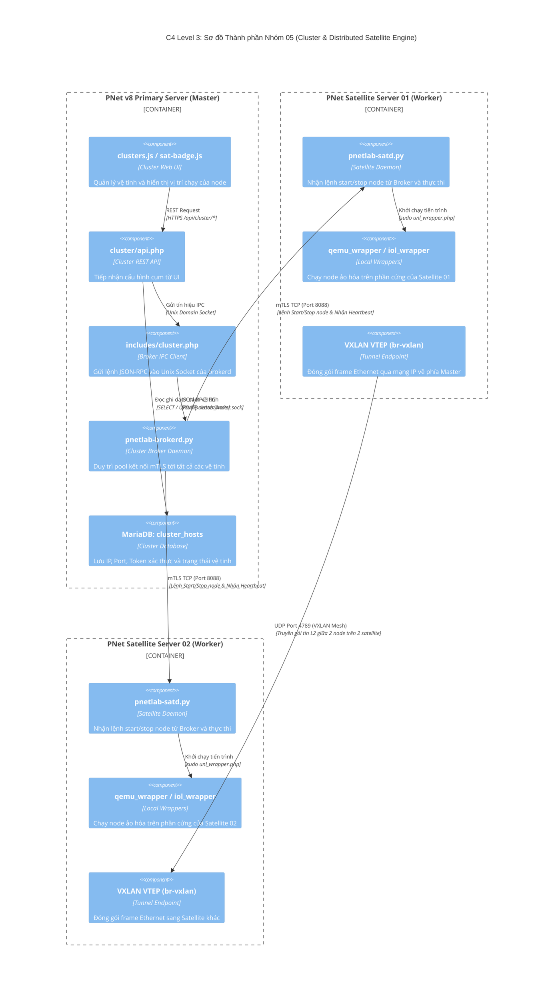

# NHÓM 05: CỤM PHÂN TÁN CLUSTER & VỆ TINH (CLUSTER & DISTRIBUTED SATELLITE ENGINE)

## 1. Mục đích của Nhóm Tính năng

Nhóm **Cụm phân tán Cluster & Vệ tinh (Satellite)** giải quyết bài toán giới hạn tài nguyên tính toán (CPU, RAM, I/O đĩa) của một máy chủ vật lý đơn lẻ bằng cách kết nối nhiều máy chủ thành một cụm tính toán thống nhất:
1. **Kiến trúc Máy chủ Chính - Vệ tinh (Master - Satellite Architecture)**: Máy chủ Primary (Master) đóng vai trò điều phối trung tâm, lưu trữ cơ sở dữ liệu, quản lý người dùng và phục vụ giao diện Web. Các máy chủ Satellite (Vệ tinh) đóng vai trò Worker Nodes thực thi các tiến trình ảo hóa nặng (QEMU, IOL, Docker).
2. **Bộ Điều phối Cụm Trung tâm (`pnetlab-brokerd`)**: Daemon Python asyncio hiệu năng cao chạy trên Master, chịu trách nhiệm nhận lệnh điều khiển node từ Web API và chuyển tiếp đến các Satellite tương ứng qua kết nối socket an toàn.
3. **Agent Giám sát Vệ tinh (`pnetlab-satd`)**: Daemon chạy trên mỗi máy chủ vệ tinh, định kỳ gửi nhịp tim (heartbeat), báo cáo tình trạng tải CPU/RAM, và nhận lệnh Start/Stop/Wipe node từ Broker Master.
4. **Cơ chế Phân bổ Vị trí Node Linh hoạt (Node Placement Policy)**: Cho phép người dùng hoặc hệ thống tự động chỉ định từng thiết bị cụ thể trong bài lab sẽ chạy trên Master hay chạy trên một máy chủ Satellite cụ thể (`pnetlab-node-runon.js`).
5. **Thông luồng Mạng Xuyên Cụm (Cross-Host Network Fabric)**: Tự động thiết lập các đường hầm mạng ảo (VXLAN / GRE / Bridge Tunnels) giữa Master và các Satellites, giúp 2 thiết bị mạng nằm trên 2 máy chủ vật lý khác nhau vẫn có thể nối dây mạng L2 trực tiếp như đang cắm chung một switch.

---

## 2. Danh sách Toàn bộ Tính năng Con Thuộc Nhóm (Dẫn tới Level 2)

Dưới đây là 5 tính năng con độc lập thuộc Nhóm 05, được đặc tả chi tiết tại thư mục `02-features/cluster-satellite/`:

| Mã tính năng | Tên tính năng con | File tài liệu Level 2 | Tóm tắt Chức năng |
| :---: | :--- | :--- | :--- |
| **F26** | **Bộ Điều phối Cụm Trung tâm (Cluster Broker Daemon)** | [`F26-cluster-broker-daemon.md`](../02-features/cluster-satellite/F26-cluster-broker-daemon.md) | Vận hành của daemon `pnetlab-brokerd.py`: Quản lý pool kết nối, tiếp nhận lệnh JSON-RPC và định tuyến lệnh sang Satellite |
| **F27** | **Đăng ký & Quản lý Vòng đời Vệ tinh (Satellite Agent Lifecycle)** | [`F27-satellite-agent-lifecycle.md`](../02-features/cluster-satellite/F27-satellite-agent-lifecycle.md) | Kịch bản `pnet-satellite-join`, daemon `pnetlab-satd.py`, quy trình handshake xác thực và đồng bộ cấu hình |
| **F28** | **Điều phối Vị trí Node Chạy (Node Cluster Placement)** | [`F28-node-cluster-placement.md`](../02-features/cluster-satellite/F28-node-cluster-placement.md) | Gán thuộc tính `run_on` cho từng node, lưu trữ trong bảng `cluster_placements`, hiển thị huy hiệu vệ tinh trên Canvas |
| **F29** | **Đồng bộ Luồng Mạng Xuyên Cụm (Cross-Bridge Network Sync)** | [`F29-cluster-cross-bridge-sync.md`](../02-features/cluster-satellite/F29-cluster-cross-bridge-sync.md) | Tự động tạo kết nối VXLAN/GRE tunnel giữa các host khi có liên kết mạng giữa các node ở khác máy chủ |
| **F30** | **Kiểm tra Sức khỏe Cụm & Cảnh báo (Cluster Health & Failover)** | [`F30-cluster-health-failover.md`](../02-features/cluster-satellite/F30-cluster-health-failover.md) | Cơ chế Heartbeat định kỳ, phát hiện vệ tinh mất kết nối, cập nhật trạng thái bảng `cluster_hosts` và cảnh báo UI |

---

## 3. Các Module & File Mã nguồn Chịu trách nhiệm Chính

| Đường dẫn File / Thư mục | Ngôn ngữ / Loại | Vai trò chính |
| :--- | :--- | :--- |
| `/opt/unetlab/scripts/pnetlab-brokerd.py` | Python (asyncio) | Daemon trung tâm điều phối cụm (341KB code), quản lý kết nối mTLS và điều phối lệnh |
| `/opt/unetlab/scripts/pnetlab-satd.py` | Python | Daemon agent chạy trên từng máy chủ vệ tinh để nhận lệnh và báo cáo tình trạng |
| `/opt/unetlab/scripts/pnet-satellite-join` | Shell Script | Script dòng lệnh hướng dẫn máy chủ vệ tinh đăng ký vào cụm Master |
| `/opt/unetlab/html/cluster/api.php` | PHP | REST API quản trị cụm: Liệt kê danh sách host, thêm vệ tinh, xóa vệ tinh, xem tải |
| `/opt/unetlab/html/includes/cluster.php` | PHP | Thư viện giao tiếp giữa PHP API và socket IPC của `pnetlab-brokerd` |
| `/opt/unetlab/html/main/js/clusters.js` | JavaScript | Giao diện quản lý danh sách các máy chủ trong cụm, biểu đồ RAM/CPU từng host |
| `/opt/unetlab/html/themes/default/js/pnetlab-node-runon.js` | JavaScript | Modal cho phép người dùng chọn host chạy cho từng node trên Canvas |
| `/opt/unetlab/html/themes/default/js/pnetlab-sat-badge.js` | JavaScript | Vẽ huy hiệu (Badge) mang tên vệ tinh lên góc trên icon của node trên Canvas |

---

## 4. Sơ đồ Component Diagram (C4 Level 3: Cluster & Distributed Satellite Engine)

---

> 👉 **Xem chi tiết từng tính năng con**:
> 1. [`F26-cluster-broker-daemon.md`](../02-features/cluster-satellite/F26-cluster-broker-daemon.md) — Bộ Điều phối Cụm Trung tâm (Cluster Broker Daemon)
> 2. [`F27-satellite-agent-lifecycle.md`](../02-features/cluster-satellite/F27-satellite-agent-lifecycle.md) — Đăng ký & Quản lý Vòng đời Vệ tinh (Satellite Agent Lifecycle)
> 3. [`F28-node-cluster-placement.md`](../02-features/cluster-satellite/F28-node-cluster-placement.md) — Điều phối Vị trí Node Chạy (Node Cluster Placement)
> 4. [`F29-cluster-cross-bridge-sync.md`](../02-features/cluster-satellite/F29-cluster-cross-bridge-sync.md) — Đồng bộ Luồng Mạng Xuyên Cụm (Cross-Bridge Network Sync)
> 5. [`F30-cluster-health-failover.md`](../02-features/cluster-satellite/F30-cluster-health-failover.md) — Kiểm tra Sức khỏe Cụm & Cảnh báo (Cluster Health & Failover)
