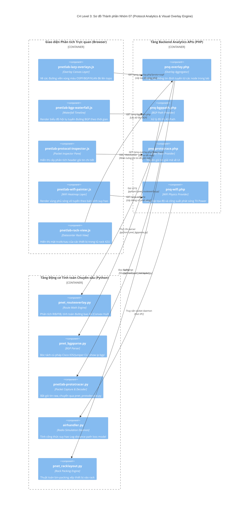

# NHÓM 07: PHÂN TÍCH GIAO THỨC & LỚP PHỦ TRỰC QUAN (PROTOCOL ANALYTICS & VISUAL OVERLAY ENGINE)

## 1. Mục đích của Nhóm Tính năng

Nhóm **Phân tích Giao thức & Lớp phủ Trực quan (Overlay)** là phân hệ tính năng cao cấp độc quyền của PNet v8, đưa việc học và vận hành mạng lên một tầm cao mới:
1. **Lớp phủ Đồ họa Giao thức Định tuyến (Dynamic Routing Protocol Overlays)**: Cho phép bật/tắt các lớp màu hiển thị trực quan các đường đi của từng giao thức định tuyến khác nhau (BGP, OSPF Areas, IS-IS Levels, RIP, Static Routes, VXLAN VNI Tunnels) đè lên trên sơ đồ mạng logic (`pnet_routeoverlay.py`, `pnq-overlay.php`).
2. **Khám phá Hội tụ & Thác đổ Tuyến đường BGP (BGP Waterfall & Path Explorer)**: Thu thập bảng BGP RIB từ các router, phân tích thuộc tính AS-Path, Local Preference, MED, Community và vẽ đồ thị thác đổ hội tụ BGP trực quan (`pnet_bgpparse.py`, `pnq-bgppath.php`).
3. **Bộ Theo dõi & Giải mã Gói tin Trực tiếp (Live Packet Prototracer & Decoder)**: Bắt và giải mã tức thời các trường tiêu đề của các gói tin giao thức mạng (ARP, ICMP, OSPF Hello, BGP Open/Update, LACP, STP BPDU, LLDP) ngay trên màn hình Canvas mà không cần phải mở phần mềm Wireshark ngoài (`pnetlab-prototracer.py`, `pnet_protodecode.py`).
4. **Phân tích Hiệu năng Mạng RoCE v2 (RDMA over Converged Ethernet Analytics)**: Đo đạc và trực quan hóa luồng dữ liệu RDMA hiệu năng cao trong môi trường Datacenter / AI Cluster, theo dõi tình trạng tắc nghẽn PFC (Priority Flow Control) và ECN.
5. **Mô phỏng Mạng Vô tuyến Ảo (Virtual 802.11 WiFi Simulation)**: Giả lập môi trường truyền sóng vô tuyến trong không khí giữa các Access Point và Client ảo, tính toán độ suy hao tín hiệu theo khoảng cách (Path Loss), vẽ biểu đồ nhiệt vùng phủ sóng (RSSI Heatmap), và bắt gói tin không dây qua monitor mode (`airhandler.py`, `pnet-wifi-truth.py`).
6. **Chuyển đổi Topo sang Sơ đồ Tủ Rack Trung tâm Dữ liệu (Datacenter Rack View)**: Tự động tính toán kích thước đơn vị rack (1U, 2U, 4U) của các thiết bị trong lab và dựng nên sơ đồ tủ rack 42U chuẩn công nghiệp (`pnet_racklayout.py`, `pnetlab-rack-view.js`).

---

## 2. Danh sách Toàn bộ Tính năng Con Thuộc Nhóm (Dẫn tới Level 2)

Dưới đây là 7 tính năng con độc lập thuộc Nhóm 07, được đặc tả chi tiết tại thư mục `02-features/protocol-overlay/`:

| Mã tính năng | Tên tính năng con | File tài liệu Level 2 | Tóm tắt Chức năng |
| :---: | :--- | :--- | :--- |
| **F37** | **Lớp phủ Trực quan Đường đi Giao thức (Routing Overlays)** | [`F37-routing-protocol-overlay.md`](../02-features/protocol-overlay/F37-routing-protocol-overlay.md) | Vẽ lớp phủ màu phân biệt OSPF Areas, BGP Peering, ISIS Levels, VXLAN Fabric trên sơ đồ mạng |
| **F38** | **Phân tích Bảng Định tuyến & Thác đổ BGP (BGP Waterfall)** | [`F38-bgp-waterfall-analytics.md`](../02-features/protocol-overlay/F38-bgp-waterfall-analytics.md) | Thu thập BGP routes qua SSH/Telnet, phân tích AS-Path và render biểu đồ thác đổ hội tụ |
| **F39** | **Giải mã Gói tin Trực tiếp trên Canvas (Packet Prototracer)** | [`F39-live-packet-prototracer.md`](../02-features/protocol-overlay/F39-live-packet-prototracer.md) | Daemon `pnetlab-prototracer.py` đọc raw socket, giải mã các trường header L2/L3/L4 và hiển thị popup |
| **F40** | **Phân tích Mạng RoCE v2 & RDMA Datacenter (RoCE Analytics)** | [`F40-roce-rdma-telemetry.md`](../02-features/protocol-overlay/F40-roce-rdma-telemetry.md) | Giám sát luồng lưu lượng RDMA, tỷ lệ drop gói và cờ phản hồi tắc nghẽn ECN/CNP |
| **F41** | **Giả lập Sóng Vô tuyến 802.11 & Biểu đồ Nhiệt (vWiFi Engine)**| [`F41-virtual-wifi-simulation.md`](../02-features/protocol-overlay/F41-virtual-wifi-simulation.md) | Daemon `airhandler.py` tính toán suy hao theo khoảng cách và vẽ heatmap RSSI trên Canvas |
| **F42** | **Bắt Gói tin Vô tuyến Không dây (vWiFi Spy Capture)** | [`F42-virtual-wifi-spy-capture.md`](../02-features/protocol-overlay/F42-virtual-wifi-spy-capture.md) | Kịch bản `vwifi-spy-capture.py` đưa interface ảo vào Monitor Mode để thu thập khung tin 802.11 Beacon/Probe |
| **F43** | **Tự động Dựng Sơ đồ Bố trí Tủ Rack (Datacenter Rack View)** | [`F43-datacenter-rack-view.md`](../02-features/protocol-overlay/F43-datacenter-rack-view.md) | Script `pnet_racklayout.py` tính toán không gian U rack và render mô hình tủ rack thiết bị trực quan |

---

## 3. Các Module & File Mã nguồn Chịu trách nhiệm Chính

| Đường dẫn File / Thư mục | Ngôn ngữ / Loại | Vai trò chính |
| :--- | :--- | :--- |
| `/opt/unetlab/scripts/pnet_routeoverlay.py` | Python (107KB) | Động cơ phân tích bảng định tuyến và tính toán tọa độ đường bao overlay |
| `/opt/unetlab/scripts/pnet_bgpparse.py` | Python (36KB) | Bộ bóc tách thông tin BGP neighbor, bảng prefix và AS-Path |
| `/opt/unetlab/scripts/pnetlab-prototracer.py`| Python | Bắt và giải mã gói tin thô trên các TAP interface |
| `/opt/unetlab/scripts/pnet_protodecode.py` | Python (57KB) | Thư viện giải mã chuyên sâu hơn 40 giao thức mạng viễn thông |
| `/opt/unetlab/scripts/airhandler.py` | Python (31KB) | Động cơ vật lý mô phỏng lan truyền sóng điện từ trong không gian 2D |
| `/opt/unetlab/scripts/pnet_racklayout.py` | Python (19KB) | Thuật toán xếp chồng thiết bị vào tủ rack 42U |
| `/opt/unetlab/html/pnq-overlay.php` | PHP (65KB) | REST API phục vụ dữ liệu overlay định tuyến cho frontend |
| `/opt/unetlab/html/pnq-bgppath.php` | PHP | API trả về cấu trúc đồ thị quan hệ AS-Path |
| `/opt/unetlab/html/pnq-prototrace.php` | PHP | API phục vụ dòng dữ liệu giải mã gói tin thời gian thực |
| `/opt/unetlab/html/pnq-wifi.php` | PHP | API lấy thông số RSSI và danh sách AP/Client lân cận |
| `/opt/unetlab/html/pnq-roce.php` | PHP | API cung cấp dữ liệu đo kiểm RDMA |
| `/opt/unetlab/html/themes/default/js/pnetlab-lazy-overlays.js`| JavaScript | Quản lý việc hiển thị/ẩn các lớp phủ giao thức trên Canvas |
| `/opt/unetlab/html/themes/default/js/pnetlab-wifi-painter.js` | JavaScript | Vẽ gradient màu biểu đồ nhiệt vô tuyến (WiFi RSSI Heatmap) |
| `/opt/unetlab/html/themes/default/js/pnetlab-rack-view.js` | JavaScript | Giao diện hiển thị đồ họa tủ Rack Datacenter tương tác |

---

## 4. Sơ đồ Component Diagram (C4 Level 3: Protocol Analytics Engine)

---

> 👉 **Xem chi tiết từng tính năng con**:
> 1. [`F37-routing-protocol-overlay.md`](../02-features/protocol-overlay/F37-routing-protocol-overlay.md) — Lớp phủ Trực quan Đường đi Giao thức (Routing Overlays)
> 2. [`F38-bgp-waterfall-analytics.md`](../02-features/protocol-overlay/F38-bgp-waterfall-analytics.md) — Phân tích Bảng Định tuyến & Thác đổ BGP (BGP Waterfall)
> 3. [`F39-live-packet-prototracer.md`](../02-features/protocol-overlay/F39-live-packet-prototracer.md) — Giải mã Gói tin Trực tiếp trên Canvas (Packet Prototracer)
> 4. [`F40-roce-rdma-telemetry.md`](../02-features/protocol-overlay/F40-roce-rdma-telemetry.md) — Phân tích Mạng RoCE v2 & RDMA Datacenter (RoCE Analytics)
> 5. [`F41-virtual-wifi-simulation.md`](../02-features/protocol-overlay/F41-virtual-wifi-simulation.md) — Giả lập Sóng Vô tuyến 802.11 & Biểu đồ Nhiệt (vWiFi Engine)
> 6. [`F42-virtual-wifi-spy-capture.md`](../02-features/protocol-overlay/F42-virtual-wifi-spy-capture.md) — Bắt Gói tin Vô tuyến Không dây (vWiFi Spy Capture)
> 7. [`F43-datacenter-rack-view.md`](../02-features/protocol-overlay/F43-datacenter-rack-view.md) — Tự động Dựng Sơ đồ Bố trí Tủ Rack (Datacenter Rack View)
