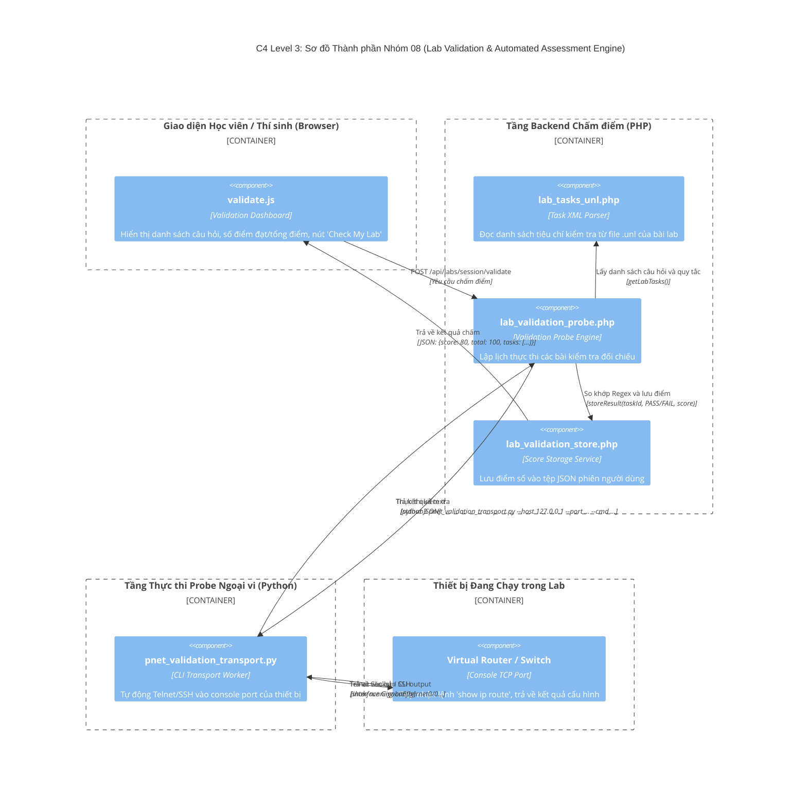

# NHÓM 08: THẨM ĐỊNH & CHẤM ĐIỂM LAB TỰ ĐỘNG (LAB VALIDATION & AUTOMATED ASSESSMENT ENGINE)

## 1. Mục đích của Nhóm Tính năng

Nhóm **Thẩm định & Chấm điểm Lab Tự động** là hệ thống khảo sát, kiểm tra và chấm điểm tự động các bài thực hành mạng dành cho giảng viên, trung tâm đào tạo và doanh nghiệp sát hạch kỹ năng:
1. **Định nghĩa Bộ Tiêu chí Đánh giá Linh hoạt (Task & Validation Rules Definition)**: Cho phép tác giả bài lab định nghĩa danh sách các nhiệm vụ (Tasks) cần hoàn thành trong file XML của bài lab. Mỗi task gắn liền với một hoặc nhiều tiêu chí kiểm tra (ví dụ: Router A phải ping thông Router B; VLAN 10 phải được tạo trên Switch; OSPF Neighbor phải ở trạng thái FULL).
2. **Động cơ Chạy Thăm dò Trực tiếp (Live Probe Engine - `lab_validation_probe.php`)**: Khi người dùng nhấn nút "Kiểm tra bài lab" (Validate Lab), động cơ sẽ kích hoạt các bài kiểm tra chạy đồng thời hoặc tuần tự đối chiếu với thiết bị thật đang chạy.
3. **Kênh Vận chuyển & Thực thi Lệnh Tự động (`pnet_validation_transport.py`)**: Mở kênh Telnet/SSH/API trực tiếp vào thiết bị đang chạy trong lab, gửi các lệnh kiểm tra cấu hình (`show ip interface brief`, `show ip route`, `show run`), bóc tách kết quả đầu ra bằng Regex (Regular Expressions) hoặc khớp chuỗi chính xác để xác minh cấu hình.
4. **Lưu trữ Kết quả & Chấm điểm Theo Thời gian (Validation Store & Progress Reporting)**: Lưu lại toàn bộ lịch sử các lần kiểm tra, tính toán tổng số điểm đạt được (Score), tỷ lệ hoàn thành (%) và hiển thị trực quan lên giao diện người dùng (`validate.js`).

---

## 2. Danh sách Toàn bộ Tính năng Con Thuộc Nhóm (Dẫn tới Level 2)

Dưới đây là 4 tính năng con độc lập thuộc Nhóm 08, được đặc tả chi tiết tại thư mục `02-features/lab-validation/`:

| Mã tính năng | Tên tính năng con | File tài liệu Level 2 | Tóm tắt Chức năng |
| :---: | :--- | :--- | :--- |
| **F44** | **Định nghĩa Nhiệm vụ & Cấu trúc Tiêu chí Lab (Task Definition)** | [`F44-validation-task-definition.md`](../02-features/lab-validation/F44-validation-task-definition.md) | Cấu trúc thẻ `<tasks>` trong file `.unl`, định nghĩa trọng số điểm, câu lệnh kiểm tra và điều kiện đạt |
| **F45** | **Động cơ Thực thi Kiểm tra Tự động (Probe Engine)** | [`F45-validation-probe-engine.md`](../02-features/lab-validation/F45-validation-probe-engine.md) | Vận hành của `lab_validation_probe.php`: Phân loại probe (ICMP ping, Port check, CLI regex matching) |
| **F46** | **Kênh Giao tiếp Thực thi Lệnh CLI (Transport Executor)** | [`F46-validation-transport-executor.md`](../02-features/lab-validation/F46-validation-transport-executor.md) | Kịch bản `pnet_validation_transport.py`: Đăng nhập Telnet/SSH vào node, gửi lệnh và hứng output |
| **F47** | **Lưu trữ Điểm số & Báo cáo Tiến độ (Validation Store & UI)** | [`F47-validation-score-report.md`](../02-features/lab-validation/F47-validation-score-report.md) | Lưu kết quả vào `lab_validation_store.php`, hiển thị checklist task hoàn thành và thanh % tiến độ trên UI |

---

## 3. Các Module & File Mã nguồn Chịu trách nhiệm Chính

| Đường dẫn File / Thư mục | Ngôn ngữ / Loại | Vai trò chính |
| :--- | :--- | :--- |
| `/opt/unetlab/html/includes/lab_validation_probe.php` | PHP (34KB) | Động cơ điều phối và phân tích các bài kiểm tra validation |
| `/opt/unetlab/html/includes/lab_validation_store.php` | PHP (36KB) | Tầng lưu trữ kết quả kiểm tra, chấm điểm và tính toán lịch sử |
| `/opt/unetlab/html/includes/lab_tasks_unl.php` | PHP | Trích xuất và cập nhật các thẻ `<tasks>` trong file `.unl` |
| `/opt/unetlab/scripts/pnet_validation_transport.py` | Python | Kênh vận chuyển kết nối dòng lệnh Telnet/SSH vào thiết bị ảo |
| `/opt/unetlab/html/themes/default/js/validate.js` | JavaScript | Giao diện thanh tiến độ hoàn thành, danh sách task và nút "Check Lab" |

---

## 4. Sơ đồ Component Diagram (C4 Level 3: Lab Validation Engine)

---

> 👉 **Xem chi tiết từng tính năng con**:
> 1. [`F44-validation-task-definition.md`](../02-features/lab-validation/F44-validation-task-definition.md) — Định nghĩa Nhiệm vụ & Cấu trúc Tiêu chí Lab (Task Definition)
> 2. [`F45-validation-probe-engine.md`](../02-features/lab-validation/F45-validation-probe-engine.md) — Động cơ Thực thi Kiểm tra Tự động (Probe Engine)
> 3. [`F46-validation-transport-executor.md`](../02-features/lab-validation/F46-validation-transport-executor.md) — Kênh Giao tiếp Thực thi Lệnh CLI (Transport Executor)
> 4. [`F47-validation-score-report.md`](../02-features/lab-validation/F47-validation-score-report.md) — Lưu trữ Điểm số & Báo cáo Tiến độ (Validation Store & UI)
