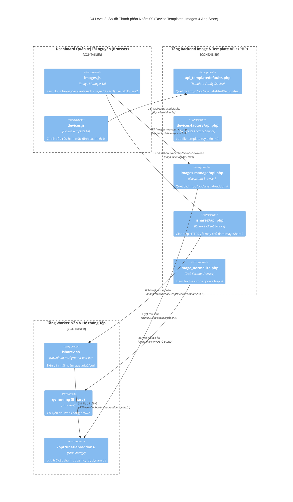

# NHÓM 09: QUẢN LÝ IMAGE, TEMPLATE THIẾT BỊ & KHO ỨNG DỤNG (DEVICE TEMPLATES, IMAGES & APP STORE)

## 1. Mục đích của Nhóm Tính năng

Nhóm **Quản lý Image, Template Thiết bị & Kho Ứng dụng** chịu trách nhiệm cung cấp toàn bộ tài nguyên nền tảng để tạo nên các thiết bị mạng ảo:
1. **Hệ thống Định nghĩa Bản mẫu Thiết bị (Device Templates Schema)**: Cung cấp hàng trăm mẫu định nghĩa sẵn cho hầu hết các dòng thiết bị mạng trên thị trường (Cisco, Juniper, Arista, Mikrotik, Linux, Windows, Fortinet...) quy định các thông số phần cứng mặc định (vCPU, RAM, card mạng, prefix tên cổng e0/0 hay ge-0/0/0, kiểu console mặc định, icon mặc định).
2. **Nhà máy Chế tạo Template Tùy biến (Custom Device Factory)**: Cho phép quản trị viên tự thiết kế các mẫu thiết bị mới chưa có trong hệ sinh thái mặc định (`devices-factory/api.php`) và chia sẻ giữa các người dùng.
3. **Trình Quản lý Tệp Hình ảnh Cục bộ (Local Image Filesystem Manager)**: Quản lý trực tiếp các thư mục chứa image ảo hóa trên đĩa cứng máy chủ (`/opt/unetlab/addons/qemu`, `/opt/unetlab/addons/iol`, `/opt/unetlab/addons/dynamips`), kiểm tra tính hợp lệ và phân quyền file.
4. **Kho Ứng dụng Đám mây IShare2 (IShare2 Cloud Image Store)**: Kết nối tới kho lưu trữ trực tuyến IShare2, cho phép tìm kiếm, xem mô tả và tải về các image thiết bị mạng chuẩn hóa chỉ với một cú nhấp chuột mà không cần tải lên thủ công qua WinSCP/FileZilla.
5. **Bộ Chuẩn hóa & Chuyển đổi Đĩa Ảo (Image Normalizer & Disk Formats)**: Tự động kiểm tra định dạng đĩa (QCOW2, VMDK, ISO, RAW), sửa lỗi định dạng, tạo liên kết tượng trưng (symlinks) và tối ưu hóa kích thước đĩa ảo.
6. **Bộ Sưu tập Biểu tượng Tùy biến (Custom Device Icons Manager)**: Quản lý và tải lên các icon thiết bị mạng đa dạng (Router tròn, Switch vuông, Firewall hình viên gạch, Server, Cloud) ở các định dạng SVG và PNG.

---

## 2. Danh sách Toàn bộ Tính năng Con Thuộc Nhóm (Dẫn tới Level 2)

Dưới đây là 6 tính năng con độc lập thuộc Nhóm 09, được đặc tả chi tiết tại thư mục `02-features/templates-images/`:

| Mã tính năng | Tên tính năng con | File tài liệu Level 2 | Tóm tắt Chức năng |
| :---: | :--- | :--- | :--- |
| **F48** | **Hệ thống Định nghĩa Bản mẫu Thiết bị (Template Schema)** | [`F48-device-templates-schema.md`](../02-features/templates-images/F48-device-templates-schema.md) | Cấu trúc file định nghĩa template trong `/opt/unetlab/html/templates/`, thiết lập mặc định vCPU, RAM |
| **F49** | **Nhà máy Chế tạo Mẫu Thiết bị Tùy biến (Device Factory)** | [`F49-custom-device-factory.md`](../02-features/templates-images/F49-custom-device-factory.md) | API và giao diện tạo template mới: chọn kiến trúc x86/ARM, kiểu NIC e1000/virtio, tham số QEMU bổ sung |
| **F50** | **Quản lý Thư mục Image Thiết bị Cục bộ (Image Manager)** | [`F50-image-filesystem-manager.md`](../02-features/templates-images/F50-image-filesystem-manager.md) | Quét các thư mục `/opt/unetlab/addons/` và trả về danh sách các phiên bản OS đã cài đặt |
| **F51** | **Tích hợp Kho Đám mây IShare2 (IShare2 Cloud Store)** | [`F51-ishare2-cloud-store.md`](../02-features/templates-images/F51-ishare2-cloud-store.md) | Tra cứu kho image online, tải gói về ngầm qua worker `ishare2.sh` và giải nén tự động |
| **F52** | **Bộ Chuẩn hóa Tên & Chuyển đổi Đĩa Ảo (Image Normalizer)** | [`F52-image-normalizer-qcow2.md`](../02-features/templates-images/F52-image-normalizer-qcow2.md) | Chuyển đổi định dạng file VMDK sang `virtioa.qcow2` bằng lệnh `qemu-img convert`, sửa quyền chmod |
| **F53** | **Quản lý Biểu tượng Thiết bị Đồ họa (Custom Icon Manager)** | [`F53-custom-icon-manager.md`](../02-features/templates-images/F53-custom-icon-manager.md) | Upload và quản lý các file icon PNG/SVG trong thư mục `/opt/unetlab/html/images/icons/` |

---

## 3. Các Module & File Mã nguồn Chịu trách nhiệm Chính

| Đường dẫn File / Thư mục | Ngôn ngữ / Loại | Vai trò chính |
| :--- | :--- | :--- |
| `/opt/unetlab/html/includes/api_templatedefaults.php` | PHP | Đọc và ghi các giá trị mặc định cho từng template |
| `/opt/unetlab/html/templates/` | Config/PHP Templates | Thư mục chứa hàng trăm file định nghĩa template (.php/.yml) |
| `/opt/unetlab/html/devices-factory/api.php` | PHP | API tạo và quản lý custom device templates |
| `/opt/unetlab/html/images-manage/api.php` | PHP | API kiểm tra dung lượng, xóa, đổi tên thư mục image trên đĩa cứng |
| `/opt/unetlab/html/ishare2/api.php` | PHP | API giao tiếp với kho cloud IShare2 |
| `/opt/unetlab/html/ishare2/image_normalize.php` | PHP | Bộ kiểm tra tính chuẩn tắc của cấu trúc tên thư mục image |
| `/opt/unetlab/scripts/workers/ishare2.sh` | Shell Script | Worker chạy tải ngầm image qua curl/aria2 |
| `/opt/unetlab/html/images-icons/api.php` | PHP | API quản lý upload và duyệt danh mục icon |
| `/opt/unetlab/html/main/js/devices.js` | JavaScript | Giao diện quản lý template thiết bị trên Dashboard |
| `/opt/unetlab/html/main/js/images.js` | JavaScript | Giao diện xem danh sách image cục bộ và kho IShare2 |

---

## 4. Sơ đồ Component Diagram (C4 Level 3: Template & Image Subsystem)

---

> 👉 **Xem chi tiết từng tính năng con**:
> 1. [`F48-device-templates-schema.md`](../02-features/templates-images/F48-device-templates-schema.md) — Hệ thống Định nghĩa Bản mẫu Thiết bị (Template Schema)
> 2. [`F49-custom-device-factory.md`](../02-features/templates-images/F49-custom-device-factory.md) — Nhà máy Chế tạo Mẫu Thiết bị Tùy biến (Device Factory)
> 3. [`F50-image-filesystem-manager.md`](../02-features/templates-images/F50-image-filesystem-manager.md) — Quản lý Thư mục Image Thiết bị Cục bộ (Image Manager)
> 4. [`F51-ishare2-cloud-store.md`](../02-features/templates-images/F51-ishare2-cloud-store.md) — Tích hợp Kho Đám mây IShare2 (IShare2 Cloud Store)
> 5. [`F52-image-normalizer-qcow2.md`](../02-features/templates-images/F52-image-normalizer-qcow2.md) — Bộ Chuẩn hóa Tên & Chuyển đổi Đĩa Ảo (Image Normalizer)
> 6. [`F53-custom-icon-manager.md`](../02-features/templates-images/F53-custom-icon-manager.md) — Quản lý Biểu tượng Thiết bị Đồ họa (Custom Icon Manager)
