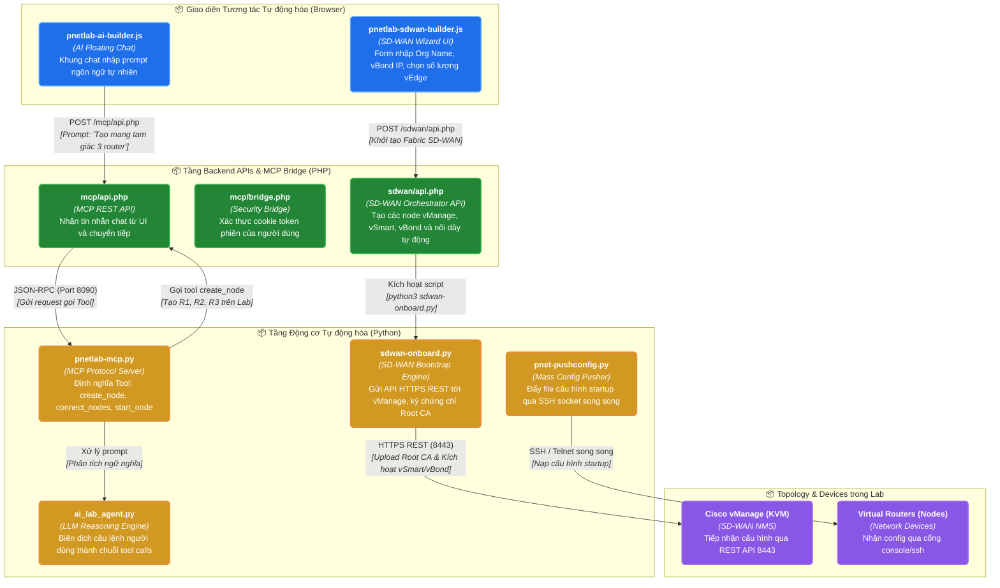

# NHÓM 10: TỰ ĐỘNG HÓA, TRỢ LÝ AI (MCP) & CISCO SD-WAN (AUTOMATION, AI & SD-WAN)

## 1. Mục đích của Nhóm Tính năng

Nhóm **Tự động hóa, Trợ lý AI (MCP) & Cisco SD-WAN** kết nối PNet v8 với các công nghệ tương lai của ngành kỹ thuật mạng:
1. **Máy chủ Model Context Protocol (MCP Server - `pnetlab-mcp.py`)**: Hiện thực hóa chuẩn giao thức mở MCP của Anthropic/Google/OpenAI, biến toàn bộ hệ thống PNet v8 thành một tập các "Tools" và "Resources" mà các trợ lý AI thông minh (LLM) có thể tự động gọi để đọc topo mạng, sinh thiết bị, nối dây và cấu hình thông số tự động.
2. **Trợ lý AI Trực quan trên Canvas (AI Lab Builder Widget)**: Một cửa sổ chat AI nhúng nổi ngay trên màn hình Canvas (`pnetlab-ai-builder.js`), cho phép kỹ sư gõ yêu cầu bằng ngôn ngữ tự nhiên (ví dụ: *"Hãy dựng cho tôi một topo mạng gồm 3 router chạy OSPF Area 0 và 1 switch L2"*) và AI sẽ tự động thao tác trên Canvas.
3. **Bộ Thiết kế & Tự động hóa Cisco SD-WAN (SD-WAN Fabric Builder)**: Tự động hóa quy trình dựng mạng diện rộng Cisco SD-WAN cực kỳ phức tạp vốn mất hàng giờ đồng hồ cấu hình thủ công (vManage, vSmart, vBond, vEdge/cEdge).
4. **Kịch bản Kích hoạt & Nạp Khởi tạo SD-WAN (`sdwan-onboard.py`)**: Tự động tạo chứng chỉ số CA nội bộ, nạp Organization Name, IP của vBond, kích hoạt License Token và ghép nối fabric tự động qua REST API của vManage.
5. **Đẩy Cấu hình Hàng loạt & Quét Dữ liệu Dòng lệnh (Config Push & CLI Scraping)**: Các kịch bản tự động hóa Python (`pnet-pushconfig.py`, `pnet-showcmd.py`, `pnet_showmany.py`) cho phép đẩy các đoạn cấu hình mẫu hoặc thu thập lệnh `show` từ hàng chục thiết bị trong lab chỉ trong vài giây.

---

## 2. Danh sách Toàn bộ Tính năng Con Thuộc Nhóm (Dẫn tới Level 2)

Dưới đây là 5 tính năng con độc lập thuộc Nhóm 10, được đặc tả chi tiết tại thư mục `02-features/automation-ai/`:

| Mã tính năng | Tên tính năng con | File tài liệu Level 2 | Tóm tắt Chức năng |
| :---: | :--- | :--- | :--- |
| **F54** | **Máy chủ Giao thức Ngữ cảnh Mô hình AI (MCP Server)** | [`F54-ai-agent-mcp-server.md`](../02-features/automation-ai/F54-ai-agent-mcp-server.md) | Vận hành của daemon `pnetlab-mcp.py` và bridge `mcp/bridge.php`: Cung cấp JSON-RPC tool-calling cho LLM |
| **F55** | **Widget Trợ lý AI Sinh Topo trên Canvas (AI Lab Builder)** | [`F55-ai-lab-builder-canvas.md`](../02-features/automation-ai/F55-ai-lab-builder-canvas.md) | Giao diện chat AI trên Canvas: Phân tích prompt người dùng và gọi API sinh node/link tự động |
| **F56** | **Trình Thiết kế Fabric Cisco SD-WAN Trực quan (SD-WAN Builder)**| [`F56-sdwan-fabric-builder.md`](../02-features/automation-ai/F56-sdwan-fabric-builder.md) | Trình thiết lập tham số Cisco SD-WAN: Organization Name, vBond IP, IP dải Underlay/Overlay qua UI |
| **F57** | **Tự động hóa Bootstrap & Khởi động SD-WAN (SD-WAN Onboarding)**| [`F57-sdwan-onboarding-automation.md`](../02-features/automation-ai/F57-sdwan-onboarding-automation.md) | Kịch bản `sdwan-onboard.py` nạp chứng chỉ Root CA, kích hoạt vManage, vSmart, vBond tự động |
| **F58** | **Tự động Hóa Đẩy Cấu hình & Thu Thập Lệnh (Config Push & Scrape)**| [`F58-config-push-automation.md`](../02-features/automation-ai/F58-config-push-automation.md) | Các công cụ `pnet-pushconfig.py` và `pnet-showcmd.py` chạy đa luồng qua SSH/Telnet vào hàng chục node |

---

## 3. Các Module & File Mã nguồn Chịu trách nhiệm Chính

| Đường dẫn File / Thư mục | Ngôn ngữ / Loại | Vai trò chính |
| :--- | :--- | :--- |
| `/opt/unetlab/scripts/mcp/pnetlab-mcp.py` | Python (52KB) | Máy chủ Model Context Protocol (MCP), đăng ký các công cụ quản trị lab |
| `/opt/unetlab/scripts/mcp/ai_lab_agent.py` | Python (28KB) | Agent thông minh xử lý prompt ngôn ngữ tự nhiên thành chuỗi hành động |
| `/opt/unetlab/html/mcp/api.php` | PHP | REST API tiếp nhận truy vấn MCP từ Web Canvas |
| `/opt/unetlab/html/mcp/bridge.php` | PHP | Cầu nối xác thực phiên đăng nhập web với MCP daemon |
| `/opt/unetlab/scripts/sdwan/sdwan-onboard.py` | Python (55KB) | Tự động hóa kết nối và xác thực Cisco vManage / vSmart |
| `/opt/unetlab/scripts/workers/sdwan.sh` | Shell Script | Worker chạy ngầm tiến trình khởi động SD-WAN |
| `/opt/unetlab/html/sdwan/api.php` | PHP | REST API cấu hình thông số SD-WAN |
| `/opt/unetlab/scripts/pnet-pushconfig.py` | Python (11KB) | Kịch bản đẩy file cấu hình đa luồng qua Netmiko / Telnetlib |
| `/opt/unetlab/scripts/pnet-showcmd.py` | Python (12KB) | Kịch bản thu thập kết quả lệnh show từ thiết bị |
| `/opt/unetlab/html/themes/default/js/pnetlab-ai-builder.js` | JavaScript | Giao diện chat widget trợ lý AI Canvas |
| `/opt/unetlab/html/themes/default/js/pnetlab-sdwan-builder.js` | JavaScript | Wizard tạo fabric SD-WAN 3 bước |

---

## 4. Sơ đồ Component Diagram (C4 Level 3: Automation & AI Subsystem)

---

> 👉 **Xem chi tiết từng tính năng con**:
> 1. [`F54-ai-agent-mcp-server.md`](../02-features/automation-ai/F54-ai-agent-mcp-server.md) — Máy chủ Giao thức Ngữ cảnh Mô hình AI (MCP Server)
> 2. [`F55-ai-lab-builder-canvas.md`](../02-features/automation-ai/F55-ai-lab-builder-canvas.md) — Widget Trợ lý AI Sinh Topo trên Canvas (AI Lab Builder)
> 3. [`F56-sdwan-fabric-builder.md`](../02-features/automation-ai/F56-sdwan-fabric-builder.md) — Trình Thiết kế Fabric Cisco SD-WAN Trực quan (SD-WAN Builder)
> 4. [`F57-sdwan-onboarding-automation.md`](../02-features/automation-ai/F57-sdwan-onboarding-automation.md) — Tự động hóa Bootstrap & Khởi động SD-WAN (SD-WAN Onboarding)
> 5. [`F58-config-push-automation.md`](../02-features/automation-ai/F58-config-push-automation.md) — Tự động Hóa Đẩy Cấu hình & Thu Thập Lệnh (Config Push & Scrape)
