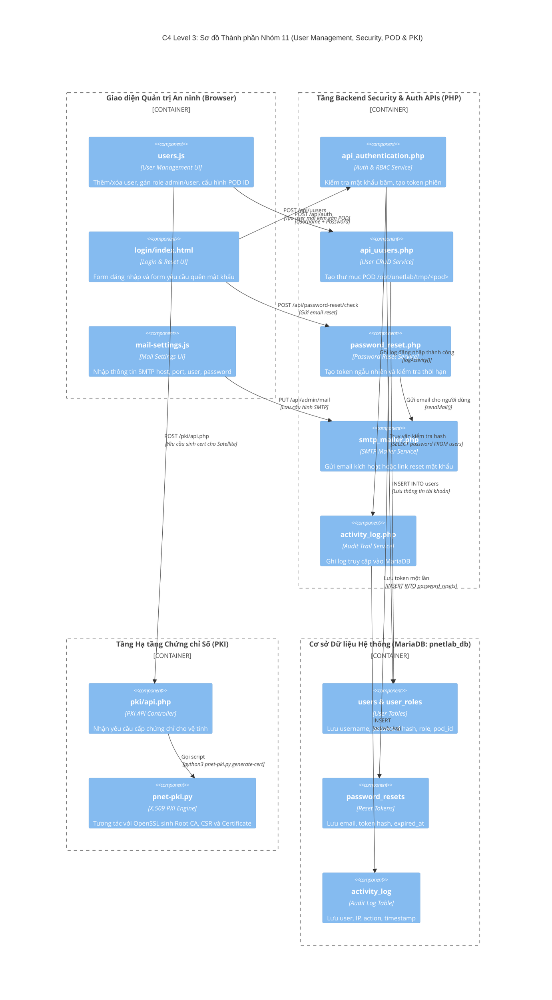

# NHÓM 11: QUẢN LÝ NGƯỜI DÙNG, PHÂN QUYỀN POD & BẢO MẬT PKI (USER, SECURITY, POD & PKI)

## 1. Mục đích của Nhóm Tính năng

Nhóm **Quản lý Người dùng, Phân quyền POD & Bảo mật PKI** thiết lập bức tường an ninh, xác thực danh tính và đảm bảo khả năng cô lập tài nguyên đa người dùng (Multi-tenancy):
1. **Kiến trúc Cô lập Không gian Làm việc theo POD (POD Multi-Tenant Isolation)**: Phân bổ cho mỗi tài khoản người dùng một số POD duy nhất (từ 0 đến 128). Mỗi POD có thư mục làm việc riêng biệt (`/opt/unetlab/tmp/<pod>/`), dải port mạng riêng và không thể can thiệp hoặc nhìn trộm thiết bị của POD khác.
2. **Kiểm soát Truy cập Dựa trên Vai trò (Role-Based Access Control - RBAC)**: Quản lý các cấp độ quyền hạn nghiêm ngặt (Admin: toàn quyền cấu hình cụm, hệ thống, template; User: chỉ thao tác trong phạm vi lab được giao; Offline: chế độ thực hành không cần kết nối mạng ngoài).
3. **Quản lý Phiên & Token Xác thực An toàn (Secure Cookie Token & Session Lifecycle)**: Áp dụng cơ chế Cookie Token kết hợp băm mật khẩu Argon2i/Bcrypt, thiết lập hạn sử dụng phiên và bảo vệ chống tấn công CSRF / Session Hijacking.
4. **Quy trình Khôi phục Mật khẩu Tự phục vụ (Self-Service Password Reset Workflow)**: Cho phép người dùng yêu cầu đặt lại mật khẩu qua email; sinh mã token một lần có thời hạn kiểm tra tại bảng `password_resets` (`password_reset.php`).
5. **Cấu hình Dịch vụ Gửi Mail Hệ thống (SMTP Mailer & Notification Engine)**: Quản lý cấu hình kết nối SMTP (SSL/TLS, cổng, chứng thực) và các mẫu email thông báo hệ thống (`smtp_mailer.php`).
6. **Hạ tầng Khóa Công khai Cụm (Cluster PKI & Certificate Management)**: Tự động khởi tạo Certificate Authority (CA) nội bộ, phát hành và ký chứng chỉ số SSL/mTLS cho các máy chủ vệ tinh Satellite kết nối vào Master an toàn tuyệt đối (`pnet-pki.py`, `pki/api.php`).
7. **Nhật ký Hoạt động & Kiểm toán An ninh (Activity Log & Security Audit)**: Ghi lại chi tiết mọi hành vi đăng nhập, tạo, sửa, xóa node, xuất cấu hình vào bảng cơ sở dữ liệu `activity_log`.

---

## 2. Danh sách Toàn bộ Tính năng Con Thuộc Nhóm (Dẫn tới Level 2)

Dưới đây là 5 tính năng con độc lập thuộc Nhóm 11, được đặc tả chi tiết tại thư mục `02-features/user-security/`:

| Mã tính năng | Tên tính năng con | File tài liệu Level 2 | Tóm tắt Chức năng |
| :---: | :--- | :--- | :--- |
| **F59** | **Phân quyền Vai trò & Cách ly POD (RBAC & POD Isolation)** | [`F59-user-rbac-pod-isolation.md`](../02-features/user-security/F59-user-rbac-pod-isolation.md) | Quản lý bảng `users`, `user_roles`, `user_permission`; gán số POD và kiểm soát giới hạn tài nguyên |
| **F60** | **Xác thực Đăng nhập & Quản lý Phiên (Auth Token & Session)** | [`F60-auth-token-session.md`](../02-features/user-security/F60-auth-token-session.md) | Luồng đăng nhập `/api/auth`, cấp phát HTTP-Only Cookie Token, kiểm tra timeout và đăng xuất |
| **F61** | **Khôi phục Mật khẩu Tự phục vụ (Password Reset Workflow)** | [`F61-password-reset-workflow.md`](../02-features/user-security/F61-password-reset-workflow.md) | Sinh token ngẫu nhiên bảo mật cao, gửi link qua email và xác thực đặt lại mật khẩu mới |
| **F62** | **Cấu hình Gửi Mail & Mẫu Thông báo (SMTP Mailer)** | [`F62-smtp-mailer-notifications.md`](../02-features/user-security/F62-smtp-mailer-notifications.md) | Cấu hình máy chủ SMTP, gửi mail kiểm tra kết nối và tùy biến nội dung mẫu email gửi người dùng |
| **F63** | **Quản lý Chứng chỉ Số Cụm (Cluster PKI & Certificates)** | [`F63-cluster-pki-certificates.md`](../02-features/user-security/F63-cluster-pki-certificates.md) | Script `pnet-pki.py`: Khởi tạo CA, sinh cặp khóa RSA 4096-bit, ký chứng chỉ mTLS cho Satellite |

---

## 3. Các Module & File Mã nguồn Chịu trách nhiệm Chính

| Đường dẫn File / Thư mục | Ngôn ngữ / Loại | Vai trò chính |
| :--- | :--- | :--- |
| `/opt/unetlab/html/includes/api_authentication.php` | PHP | Xác thực thông tin đăng nhập, sinh session token và kiểm tra quyền truy cập API |
| `/opt/unetlab/html/includes/api_uusers.php` | PHP | Nghiệp vụ CRUD người dùng, gán POD, phân quyền role |
| `/opt/unetlab/html/users/api.php` | PHP | REST API phục vụ giao diện quản lý người dùng |
| `/opt/unetlab/html/includes/password_reset.php` | PHP | Xử lý logic sinh token, kiểm tra hạn và cập nhật mật khẩu mới |
| `/opt/unetlab/html/includes/smtp_mailer.php` | PHP | Thư viện gửi email qua giao thức SMTP (hỗ trợ STARTTLS và SSL) |
| `/opt/unetlab/html/includes/activity_log.php` | PHP | Ghi lại hành vi người dùng vào bảng `activity_log` |
| `/opt/unetlab/scripts/pki/pnet-pki.py` | Python (22KB) | Quản lý vòng đời chứng chỉ số X.509, khởi tạo Root CA và phát hành Cert cho nodes |
| `/opt/unetlab/html/pki/api.php` | PHP | API kích hoạt sinh cert cho vệ tinh |
| `/opt/unetlab/html/main/js/users.js` | JavaScript | Giao diện quản lý người dùng, tạo tài khoản, phân quyền POD |
| `/opt/unetlab/html/main/js/mail-settings.js` | JavaScript | Giao diện thiết lập cấu hình SMTP server |

---

## 4. Sơ đồ Component Diagram (C4 Level 3: Security & PKI Subsystem)

---

> 👉 **Xem chi tiết từng tính năng con**:
> 1. [`F59-user-rbac-pod-isolation.md`](../02-features/user-security/F59-user-rbac-pod-isolation.md) — Phân quyền Vai trò & Cách ly POD (RBAC & POD Isolation)
> 2. [`F60-auth-token-session.md`](../02-features/user-security/F60-auth-token-session.md) — Xác thực Đăng nhập & Quản lý Phiên (Auth Token & Session)
> 3. [`F61-password-reset-workflow.md`](../02-features/user-security/F61-password-reset-workflow.md) — Khôi phục Mật khẩu Tự phục vụ (Password Reset Workflow)
> 4. [`F62-smtp-mailer-notifications.md`](../02-features/user-security/F62-smtp-mailer-notifications.md) — Cấu hình Gửi Mail & Mẫu Thông báo (SMTP Mailer)
> 5. [`F63-cluster-pki-certificates.md`](../02-features/user-security/F63-cluster-pki-certificates.md) — Quản lý Chứng chỉ Số Cụm (Cluster PKI & Certificates)
