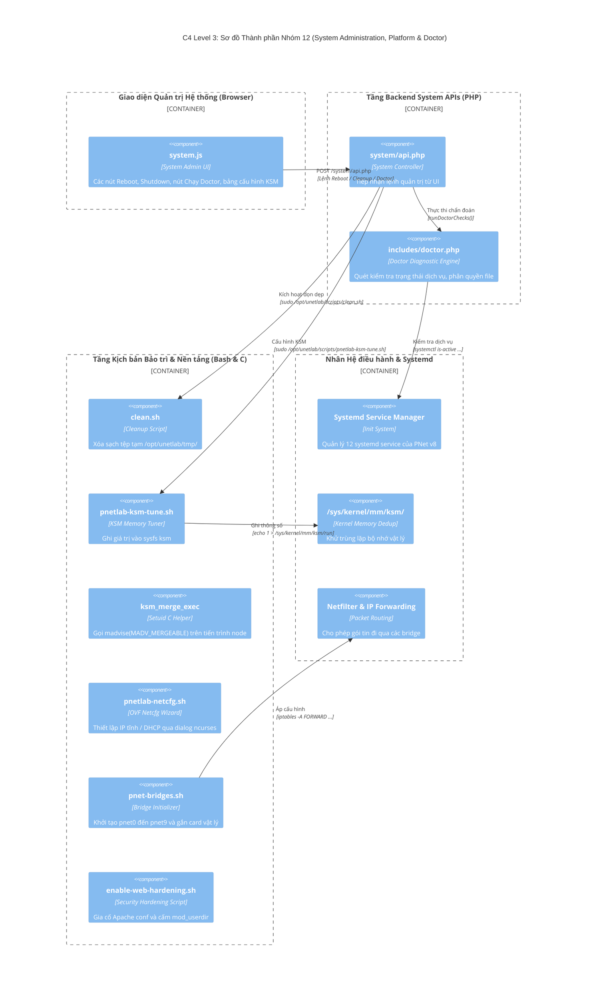

# NHÓM 12: QUẢN TRỊ HỆ THỐNG, NỀN TẢNG & DOCTOR (SYSTEM ADMINISTRATION, DIAGNOSTICS & PLATFORM)

## 1. Mục đích của Nhóm Tính năng

Nhóm **Quản trị Hệ thống, Nền tảng & Doctor** đảm bảo cho toàn bộ cỗ máy PNet v8 vận hành ổn định, tự động khắc phục các lỗi phát sinh và tối ưu hóa tài nguyên phần cứng máy chủ:
1. **Hệ thống Tự Chẩn đoán Toàn diện (PNet Doctor Diagnostics)**: Quét kiểm tra toàn bộ tính toàn vẹn của hệ thống: phát hiện các dịch vụ bị dừng (`systemd services`), kiểm tra phân quyền sai lệch trên các thư mục `/opt/unetlab/`, kiểm tra kết nối cơ sở dữ liệu MariaDB, trạng thái card mạng ảo và đưa ra các hành động sửa lỗi tự động chỉ bằng một click.
2. **Quản trị Nguồn & Vận hành Máy chủ (Power Management & System Operations)**: Cho phép quản trị viên khởi động lại máy chủ (Reboot), tắt máy chủ an toàn (Shutdown), đồng bộ thời gian NTP và dọn dẹp các tệp tin rác/tệp tạm (`clean.sh`).
3. **Tối ưu Hóa Khử Trùng lặp Bộ nhớ Chia sẻ (Kernel Samepage Merging - KSM Tuning)**: Kích hoạt tính năng KSM của Linux Kernel kết hợp script `pnetlab-ksm-tune.sh` và `ksm_merge_exec` để quét tìm các trang nhớ RAM giống nhau giữa hàng chục máy ảo QEMU/IOL đang chạy và gộp chúng lại, giúp tiết kiệm tới 40% dung lượng RAM thực tế của máy chủ.
4. **Khởi tạo Mạng Máy ảo OVF Tự động (OVF Network Firstboot Initialization)**: Tự động phát hiện cấu hình mạng khi triển khai file OVF/OVA trên VMware ESXi hoặc Proxmox, gán IP tĩnh hoặc DHCP, khởi tạo các cầu nối `pnet-bridges` (`pnetlab-netcfg.sh`, `ovfstartup.sh`).
5. **Đồng bộ & Khắc phục Cầu nối Mạng Host (Bridge LACP & Forwarding Reconcile)**: Daemon kiểm tra và thiết lập các rule iptables forward, xử lý tương thích LACP cho card mạng gộp và khôi phục trạng thái mạng sau sự cố.
6. **Tăng cứng Bảo mật Web & Chuyển đổi PHP-FPM (Security Hardening)**: Tự động cấu hình bảo vệ Content Security Policy (CSP), vô hiệu hóa các hàm nguy hiểm trong PHP và tối ưu hiệu năng thông qua kịch bản `enable-web-hardening.sh` và `enable-php-fpm.sh`.

---

## 2. Danh sách Toàn bộ Tính năng Con Thuộc Nhóm (Dẫn tới Level 2)

Dưới đây là 6 tính năng con độc lập thuộc Nhóm 12, được đặc tả chi tiết tại thư mục `02-features/system-platform/`:

| Mã tính năng | Tên tính năng con | File tài liệu Level 2 | Tóm tắt Chức năng |
| :---: | :--- | :--- | :--- |
| **F64** | **Hệ thống Chẩn đoán Tự động (PNet Doctor Diagnostics)** | [`F64-system-doctor-diagnostics.md`](../02-features/system-platform/F64-system-doctor-diagnostics.md) | Vận hành của `doctor.php` và `pnetlab_doctor.php`: Kiểm tra phân quyền file, dịch vụ systemd, disk space |
| **F65** | **Quản lý Nguồn & Vệ sinh Dữ liệu Rác (Power & Maintenance)** | [`F65-system-power-maintenance.md`](../02-features/system-platform/F65-system-power-maintenance.md) | Các lệnh khởi động lại, tắt máy chủ, xóa thư mục tmp và dọn dẹp cgroups qua `clean.sh` |
| **F66** | **Tối ưu Hóa Bộ nhớ RAM qua Linux KSM (KSM Memory Tuning)** | [`F66-ksm-memory-deduplication.md`](../02-features/system-platform/F66-ksm-memory-deduplication.md) | Tinh chỉnh thông số `/sys/kernel/mm/ksm/pages_to_scan`, `sleep_millisecs` và nhị phân `ksm_merge_exec` |
| **F67** | **Khởi tạo Mạng Máy ảo OVF Đầu tiên (OVF Firstboot Network)** | [`F67-ovf-network-initialization.md`](../02-features/system-platform/F67-ovf-network-initialization.md) | Kịch bản `ovfstartup.sh` và `pnetlab-netcfg.sh` thiết lập card mạng quản trị và cấu hình ban đầu |
| **F68** | **Đồng bộ Cầu nối & Khắc phục Luồng Chuyển tiếp (Bridge Reconcile)**| [`F68-bridge-lacp-fwd-reconcile.md`](../02-features/system-platform/F68-bridge-lacp-fwd-reconcile.md) | Kịch bản `pnet-bridges.sh` và `pnet-fwd-reconcile.sh` thiết lập các bridge pnet0-pnet9 và forwarding rules |
| **F69** | **Tăng Cứng Bảo mật Web & Tăng tốc PHP-FPM (Web Hardening)**| [`F69-security-hardening-phpfpm.md`](../02-features/system-platform/F69-security-hardening-phpfpm.md) | Tinh chỉnh bảo mật Apache, cấu hình HTTP headers CSP, chặn duyệt thư mục và kích hoạt PHP-FPM |

---

## 3. Các Module & File Mã nguồn Chịu trách nhiệm Chính

| Đường dẫn File / Thư mục | Ngôn ngữ / Loại | Vai trò chính |
| :--- | :--- | :--- |
| `/opt/unetlab/html/includes/doctor.php` | PHP (11KB) | Thư viện logic chẩn đoán lỗi hệ sinh thái PNet v8 |
| `/opt/unetlab/scripts/pnetlab_doctor.php` | PHP CLI | Trình kiểm tra doctor chạy bằng dòng lệnh terminal |
| `/opt/unetlab/html/system/api.php` | PHP | REST API thực hiện các tác vụ quản trị hệ thống |
| `/opt/unetlab/scripts/clean.sh` | Shell Script | Script xóa file tạm trong `/opt/unetlab/tmp` |
| `/opt/unetlab/scripts/pnetlab-ksm-tune.sh` | Shell Script | Script tối ưu thông số khử trùng lặp RAM KSM |
| `/opt/unetlab/wrappers/ksm_merge_exec` | C Binary | Nhị phân kích hoạt cờ `MADV_MERGEABLE` trên bộ nhớ ảo |
| `/opt/ovf/ovfstartup.sh` | Shell Script (14KB) | Kịch bản chạy khi khởi động máy ảo OVF |
| `/opt/ovf/pnetlab-netcfg.sh` | Shell Script (25KB) | Trình tương tác cấu hình mạng console ban đầu (ncurses wizard) |
| `/opt/ovf/pnet-bridges.sh` | Shell Script | Thiết lập các Linux Bridge cho 10 card Cloud |
| `/opt/ovf/pnet-fwd-reconcile.sh` | Shell Script | Khắc phục quy tắc chuyển tiếp gói tin iptables |
| `/opt/unetlab/scripts/enable-web-hardening.sh` | Shell Script (11KB) | Kịch bản tự động gia cố an ninh Apache Web Server |
| `/opt/unetlab/scripts/enable-php-fpm.sh` | Shell Script | Chuyển đổi từ mod_php sang PHP-FPM hiệu năng cao |
| `/opt/unetlab/html/main/js/system.js` | JavaScript | Giao diện quản trị hệ thống trên Dashboard |

---

## 4. Sơ đồ Component Diagram (C4 Level 3: System Administration & Doctor)

---

> 👉 **Xem chi tiết từng tính năng con**:
> 1. [`F64-system-doctor-diagnostics.md`](../02-features/system-platform/F64-system-doctor-diagnostics.md) — Hệ thống Chẩn đoán Tự động (PNet Doctor Diagnostics)
> 2. [`F65-system-power-maintenance.md`](../02-features/system-platform/F65-system-power-maintenance.md) — Quản lý Nguồn & Vệ sinh Dữ liệu Rác (Power & Maintenance)
> 3. [`F66-ksm-memory-deduplication.md`](../02-features/system-platform/F66-ksm-memory-deduplication.md) — Tối ưu Hóa Bộ nhớ RAM qua Linux KSM (KSM Memory Tuning)
> 4. [`F67-ovf-network-initialization.md`](../02-features/system-platform/F67-ovf-network-initialization.md) — Khởi tạo Mạng Máy ảo OVF Đầu tiên (OVF Firstboot Network)
> 5. [`F68-bridge-lacp-fwd-reconcile.md`](../02-features/system-platform/F68-bridge-lacp-fwd-reconcile.md) — Đồng bộ Cầu nối & Khắc phục Luồng Chuyển tiếp (Bridge Reconcile)
> 6. [`F69-security-hardening-phpfpm.md`](../02-features/system-platform/F69-security-hardening-phpfpm.md) — Tăng Cứng Bảo mật Web & Tăng tốc PHP-FPM (Web Hardening)
