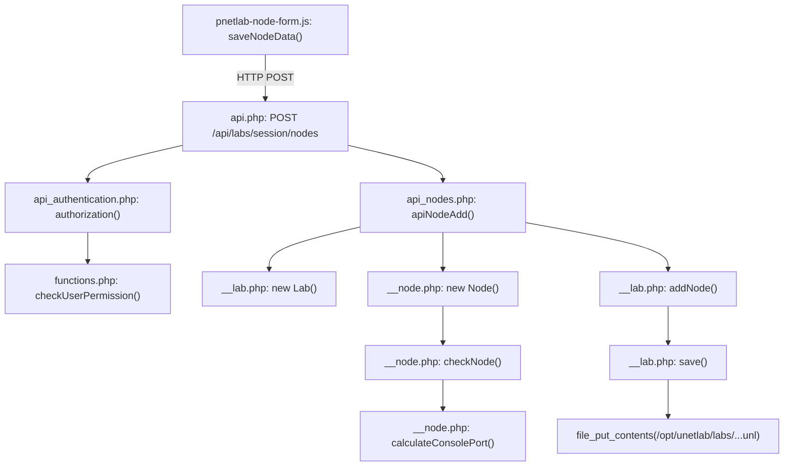

# SƠ ĐỒ GỌI HÀM (CALL GRAPH): F01 - NODE CREATE & EDIT

```mermaid
graph TD
    UI["pnetlab-node-form.js: saveNodeData()"] -->|HTTP POST| API["api.php: POST /api/labs/session/nodes"]
    API --> AUTH["api_authentication.php: authorization()"]
    AUTH --> CHECK_PERM["functions.php: checkUserPermission()"]
    API --> CONTROLLER["api_nodes.php: apiNodeAdd()"]
    CONTROLLER --> LOAD_LAB["__lab.php: new Lab()"]
    CONTROLLER --> NODE_INIT["__node.php: new Node()"]
    NODE_INIT --> VALIDATE["__node.php: checkNode()"]
    VALIDATE --> CALC_PORT["__node.php: calculateConsolePort()"]
    CONTROLLER --> LAB_ADD["__lab.php: addNode()"]
    LAB_ADD --> LAB_SAVE["__lab.php: save()"]
    LAB_SAVE --> FS_WRITE["file_put_contents(/opt/unetlab/labs/...unl)"]
```
