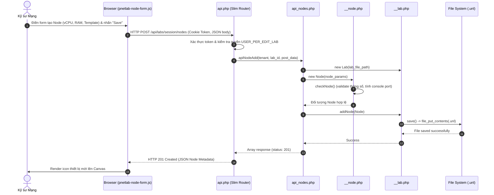

# SƠ ĐỒ TRÌNH TỰ (SEQUENCE DIAGRAM): F01 - NODE CREATE & EDIT

```mermaid
sequenceDiagram
    autonumber
    actor User as Kỹ sư Mạng
    participant UI as Browser (pnetlab-node-form.js)
    participant Slim as api.php (Slim Router)
    participant NodeAPI as api_nodes.php
    participant NodeModel as __node.php
    participant LabModel as __lab.php
    participant Storage as File System (.unl)

    User->>UI: Điền form tạo Node (vCPU, RAM, Template) & nhấn "Save"
    UI->>Slim: HTTP POST /api/labs/session/nodes (Cookie Token, JSON body)
    Slim->>Slim: Xác thực token & kiểm tra quyền USER_PER_EDIT_LAB
    Slim->>NodeAPI: apiNodeAdd(tenant, lab_id, post_data)
    NodeAPI->>LabModel: new Lab(lab_file_path)
    NodeAPI->>NodeModel: new Node(node_params)
    NodeModel->>NodeModel: checkNode() (validate thông số, tính console port)
    NodeModel-->>NodeAPI: Đối tượng Node hợp lệ
    NodeAPI->>LabModel: addNode(Node)
    LabModel->>Storage: save() -> file_put_contents(.unl)
    Storage-->>LabModel: File saved successfully
    LabModel-->>NodeAPI: Success
    NodeAPI-->>Slim: Array response (status: 201)
    Slim-->>UI: HTTP 201 Created (JSON Node Metadata)
    UI->>User: Render icon thiết bị mới lên Canvas
```
