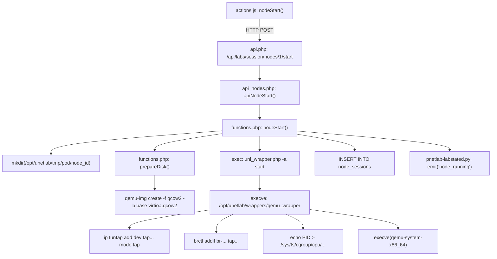

# SƠ ĐỒ GỌI HÀM (CALL GRAPH): F02 - NODE START LIFECYCLE

```mermaid
graph TD
    UI["actions.js: nodeStart()"] -->|HTTP POST| API["api.php: /api/labs/session/nodes/1/start"]
    API --> NODE_API["api_nodes.php: apiNodeStart()"]
    NODE_API --> FUNC_START["functions.php: nodeStart()"]
    FUNC_START --> MK_TMP["mkdir(/opt/unetlab/tmp/pod/node_id)"]
    FUNC_START --> PREP_DISK["functions.php: prepareDisk()"]
    PREP_DISK --> QEMU_IMG["qemu-img create -f qcow2 -b base virtioa.qcow2"]
    FUNC_START --> CLI_WRAPPER["exec: unl_wrapper.php -a start"]
    CLI_WRAPPER --> C_WRAPPER["execve: /opt/unetlab/wrappers/qemu_wrapper"]
    C_WRAPPER --> CREATE_TAP["ip tuntap add dev tap... mode tap"]
    C_WRAPPER --> BR_ATTACH["brctl addif br-... tap..."]
    C_WRAPPER --> CGROUP_ATTACH["echo PID > /sys/fs/cgroup/cpu/..."]
    C_WRAPPER --> EXEC_HYPERVISOR["execve(qemu-system-x86_64)"]
    FUNC_START --> DB_SESSION["INSERT INTO node_sessions"]
    FUNC_START --> SSE_NOTIF["pnetlab-labstated.py: emit('node_running')"]
```
