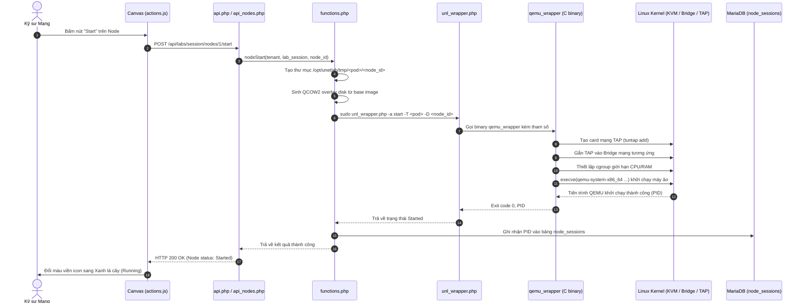

# SƠ ĐỒ TRÌNH TỰ (SEQUENCE DIAGRAM): F02 - NODE START LIFECYCLE

```mermaid
sequenceDiagram
    autonumber
    actor User as Kỹ sư Mạng
    participant UI as Canvas (actions.js)
    participant API as api.php / api_nodes.php
    participant Func as functions.php
    participant Shell as unl_wrapper.php
    participant CWrap as qemu_wrapper (C binary)
    participant Kernel as Linux Kernel (KVM / Bridge / TAP)
    participant DB as MariaDB (node_sessions)

    User->>UI: Bấm nút "Start" trên Node
    UI->>API: POST /api/labs/session/nodes/1/start
    API->>Func: nodeStart(tenant, lab_session, node_id)
    Func->>Func: Tạo thư mục /opt/unetlab/tmp/<pod>/<node_id>
    Func->>Func: Sinh QCOW2 overlay disk từ base image
    Func->>Shell: sudo unl_wrapper.php -a start -T <pod> -D <node_id>
    Shell->>CWrap: Gọi binary qemu_wrapper kèm tham số
    CWrap->>Kernel: Tạo card mạng TAP (tuntap add)
    CWrap->>Kernel: Gắn TAP vào Bridge mạng tương ứng
    CWrap->>Kernel: Thiết lập cgroup giới hạn CPU/RAM
    CWrap->>Kernel: execve(qemu-system-x86_64 ...) khởi chạy máy ảo
    Kernel-->>CWrap: Tiến trình QEMU khởi chạy thành công (PID)
    CWrap-->>Shell: Exit code 0, PID
    Shell-->>Func: Trả về trạng thái Started
    Func->>DB: Ghi nhận PID vào bảng node_sessions
    Func-->>API: Trả về kết quả thành công
    API-->>UI: HTTP 200 OK (Node status: Started)
    UI->>User: Đổi màu viền icon sang Xanh lá cây (Running)
```
