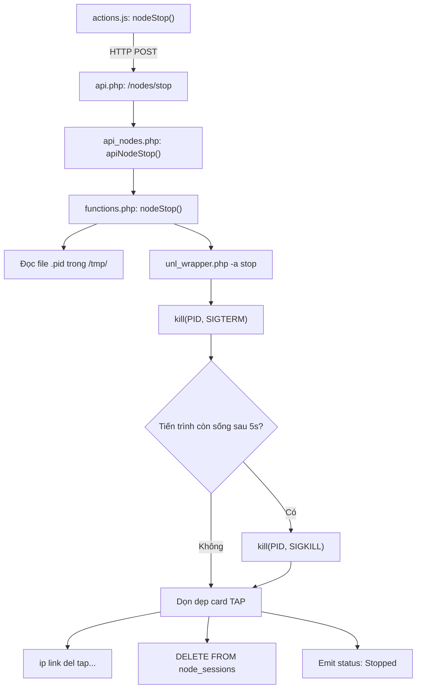

# SƠ ĐỒ GỌI HÀM (CALL GRAPH): F03 - NODE STOP & KILL

```mermaid
graph TD
    UI["actions.js: nodeStop()"] -->|HTTP POST| API["api.php: /nodes/stop"]
    API --> NODE_API["api_nodes.php: apiNodeStop()"]
    NODE_API --> FUNC_STOP["functions.php: nodeStop()"]
    FUNC_STOP --> READ_PID["Đọc file .pid trong /tmp/"]
    FUNC_STOP --> WRAPPER["unl_wrapper.php -a stop"]
    WRAPPER --> SIG_TERM["kill(PID, SIGTERM)"]
    SIG_TERM --> CHECK_ALIVE{"Tiến trình còn sống sau 5s?"}
    CHECK_ALIVE -- Có --> SIG_KILL["kill(PID, SIGKILL)"]
    CHECK_ALIVE -- Không --> CLEAN_NET["Dọn dẹp card TAP"]
    SIG_KILL --> CLEAN_NET
    CLEAN_NET --> DEL_TAP["ip link del tap..."]
    CLEAN_NET --> DEL_DB["DELETE FROM node_sessions"]
    CLEAN_NET --> SSE_NOTIF["Emit status: Stopped"]
```
