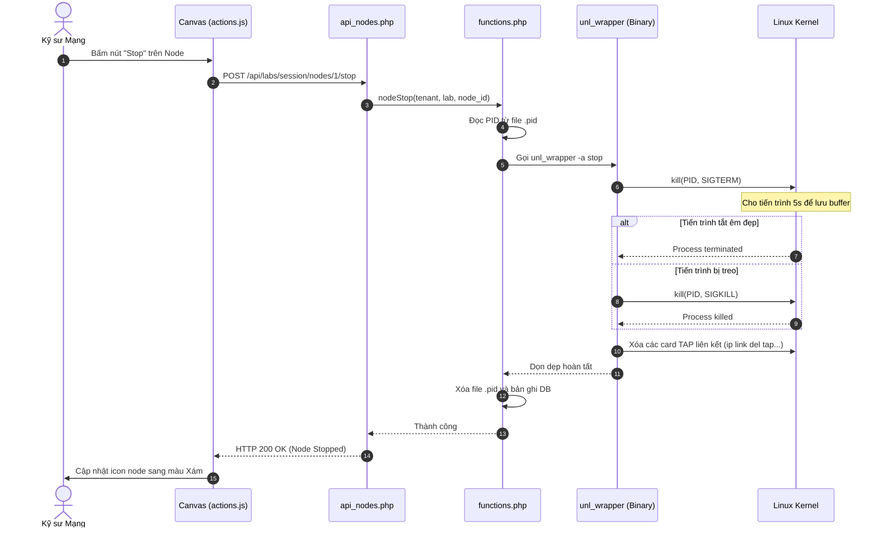

# SƠ ĐỒ TRÌNH TỰ (SEQUENCE DIAGRAM): F03 - NODE STOP & KILL

```mermaid
sequenceDiagram
    autonumber
    actor User as Kỹ sư Mạng
    participant UI as Canvas (actions.js)
    participant API as api_nodes.php
    participant Func as functions.php
    participant Wrapper as unl_wrapper (Binary)
    participant Kernel as Linux Kernel

    User->>UI: Bấm nút "Stop" trên Node
    UI->>API: POST /api/labs/session/nodes/1/stop
    API->>Func: nodeStop(tenant, lab, node_id)
    Func->>Func: Đọc PID từ file .pid
    Func->>Wrapper: Gọi unl_wrapper -a stop
    Wrapper->>Kernel: kill(PID, SIGTERM)
    Note over Kernel: Cho tiến trình 5s để lưu buffer
    alt Tiến trình tắt êm đẹp
        Kernel-->>Wrapper: Process terminated
    else Tiến trình bị treo
        Wrapper->>Kernel: kill(PID, SIGKILL)
        Kernel-->>Wrapper: Process killed
    end
    Wrapper->>Kernel: Xóa các card TAP liên kết (ip link del tap...)
    Wrapper-->>Func: Dọn dẹp hoàn tất
    Func->>Func: Xóa file .pid và bản ghi DB
    Func-->>API: Thành công
    API-->>UI: HTTP 200 OK (Node Stopped)
    UI->>User: Cập nhật icon node sang màu Xám
```
