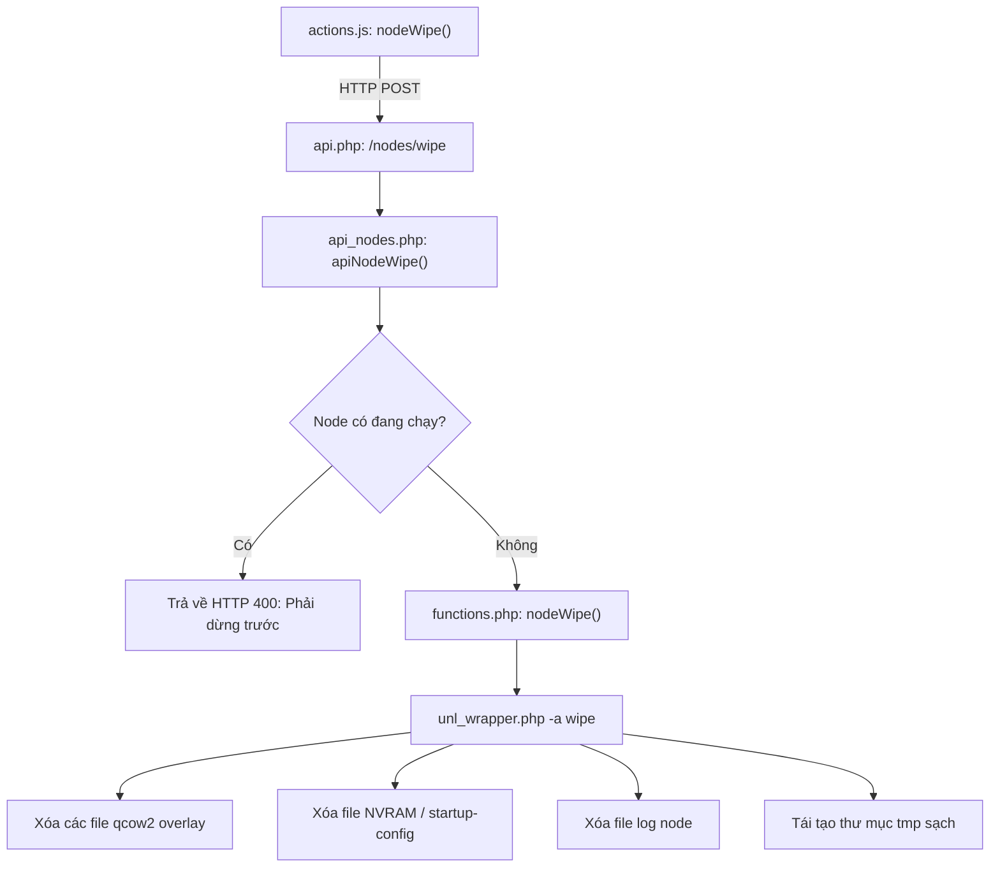

# SƠ ĐỒ GỌI HÀM (CALL GRAPH): F04 - NODE WIPE CLEAN

```mermaid
graph TD
    UI["actions.js: nodeWipe()"] -->|HTTP POST| API["api.php: /nodes/wipe"]
    API --> NODE_API["api_nodes.php: apiNodeWipe()"]
    NODE_API --> CHECK_STATUS{"Node có đang chạy?"}
    CHECK_STATUS -- Có --> ERR["Trả về HTTP 400: Phải dừng trước"]
    CHECK_STATUS -- Không --> FUNC_WIPE["functions.php: nodeWipe()"]
    FUNC_WIPE --> WRAPPER["unl_wrapper.php -a wipe"]
    WRAPPER --> RM_DISK["Xóa các file qcow2 overlay"]
    WRAPPER --> RM_NVRAM["Xóa file NVRAM / startup-config"]
    WRAPPER --> RM_LOGS["Xóa file log node"]
    WRAPPER --> REINIT_DIR["Tái tạo thư mục tmp sạch"]
```
