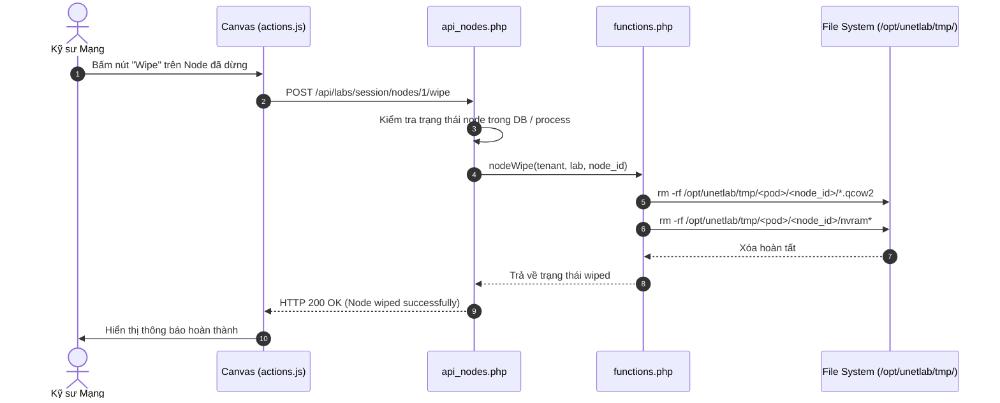

# SƠ ĐỒ TRÌNH TỰ (SEQUENCE DIAGRAM): F04 - NODE WIPE CLEAN

```mermaid
sequenceDiagram
    autonumber
    actor User as Kỹ sư Mạng
    participant UI as Canvas (actions.js)
    participant API as api_nodes.php
    participant Func as functions.php
    participant Storage as File System (/opt/unetlab/tmp/)

    User->>UI: Bấm nút "Wipe" trên Node đã dừng
    UI->>API: POST /api/labs/session/nodes/1/wipe
    API->>API: Kiểm tra trạng thái node trong DB / process
    API->>Func: nodeWipe(tenant, lab, node_id)
    Func->>Storage: rm -rf /opt/unetlab/tmp/<pod>/<node_id>/*.qcow2
    Func->>Storage: rm -rf /opt/unetlab/tmp/<pod>/<node_id>/nvram*
    Storage-->>Func: Xóa hoàn tất
    Func-->>API: Trả về trạng thái wiped
    API-->>UI: HTTP 200 OK (Node wiped successfully)
    UI->>User: Hiển thị thông báo hoàn thành
```
