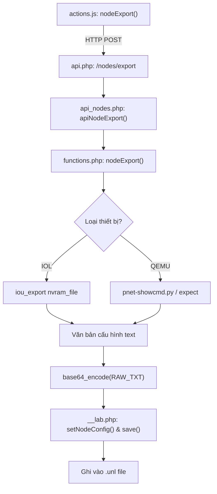

# SƠ ĐỒ GỌI HÀM (CALL GRAPH): F05 - NODE EXPORT CONFIG

```mermaid
graph TD
    UI["actions.js: nodeExport()"] -->|HTTP POST| API["api.php: /nodes/export"]
    API --> NODE_API["api_nodes.php: apiNodeExport()"]
    NODE_API --> FUNC_EXP["functions.php: nodeExport()"]
    FUNC_EXP --> TYPE_CHECK{"Loại thiết bị?"}
    TYPE_CHECK -- IOL --> IOU_EXP["iou_export nvram_file"]
    TYPE_CHECK -- QEMU --> TELNET_SCRIPTER["pnet-showcmd.py / expect"]
    IOU_EXP --> RAW_TXT["Văn bản cấu hình text"]
    TELNET_SCRIPTER --> RAW_TXT
    RAW_TXT --> B64["base64_encode(RAW_TXT)"]
    B64 --> LAB_SAVE["__lab.php: setNodeConfig() & save()"]
    LAB_SAVE --> FS_UNL["Ghi vào .unl file"]
```
