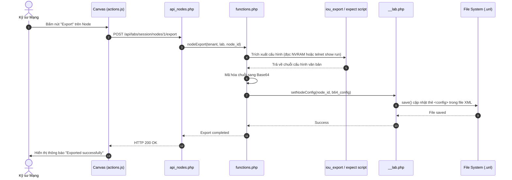

# SƠ ĐỒ TRÌNH TỰ (SEQUENCE DIAGRAM): F05 - NODE EXPORT CONFIG

```mermaid
sequenceDiagram
    autonumber
    actor User as Kỹ sư Mạng
    participant UI as Canvas (actions.js)
    participant API as api_nodes.php
    participant Func as functions.php
    participant Parser as iou_export / expect script
    participant LabModel as __lab.php
    participant File as File System (.unl)

    User->>UI: Bấm nút "Export" trên Node
    UI->>API: POST /api/labs/session/nodes/1/export
    API->>Func: nodeExport(tenant, lab, node_id)
    Func->>Parser: Trích xuất cấu hình (đọc NVRAM hoặc telnet show run)
    Parser-->>Func: Trả về chuỗi cấu hình văn bản
    Func->>Func: Mã hóa chuỗi sang Base64
    Func->>LabModel: setNodeConfig(node_id, b64_config)
    LabModel->>File: save() cập nhật thẻ <config> trong file XML
    File-->>LabModel: File saved
    LabModel-->>Func: Success
    Func-->>API: Export completed
    API-->>UI: HTTP 200 OK
    UI->>User: Hiển thị thông báo "Exported successfully"
```
