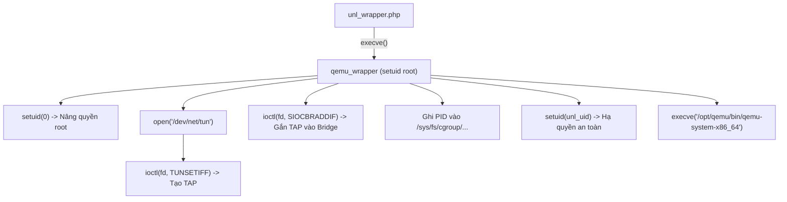

# SƠ ĐỒ GỌI HÀM (CALL GRAPH): F06 - BINARY WRAPPERS

```mermaid
graph TD
    PHP_CLI["unl_wrapper.php"] -->|"execve()"| WRAPPER["qemu_wrapper (setuid root)"]
    WRAPPER --> SET_EUID["setuid(0) -> Nâng quyền root"]
    WRAPPER --> TUN_OPEN["open('/dev/net/tun')"]
    TUN_OPEN --> IOCTL_TAP["ioctl(fd, TUNSETIFF) -> Tạo TAP"]
    WRAPPER --> IOCTL_BR["ioctl(fd, SIOCBRADDIF) -> Gắn TAP vào Bridge"]
    WRAPPER --> CGROUP["Ghi PID vào /sys/fs/cgroup/..."]
    WRAPPER --> DROP_PRIV["setuid(unl_uid) -> Hạ quyền an toàn"]
    WRAPPER --> EXEC_QEMU["execve('/opt/qemu/bin/qemu-system-x86_64')"]
```
