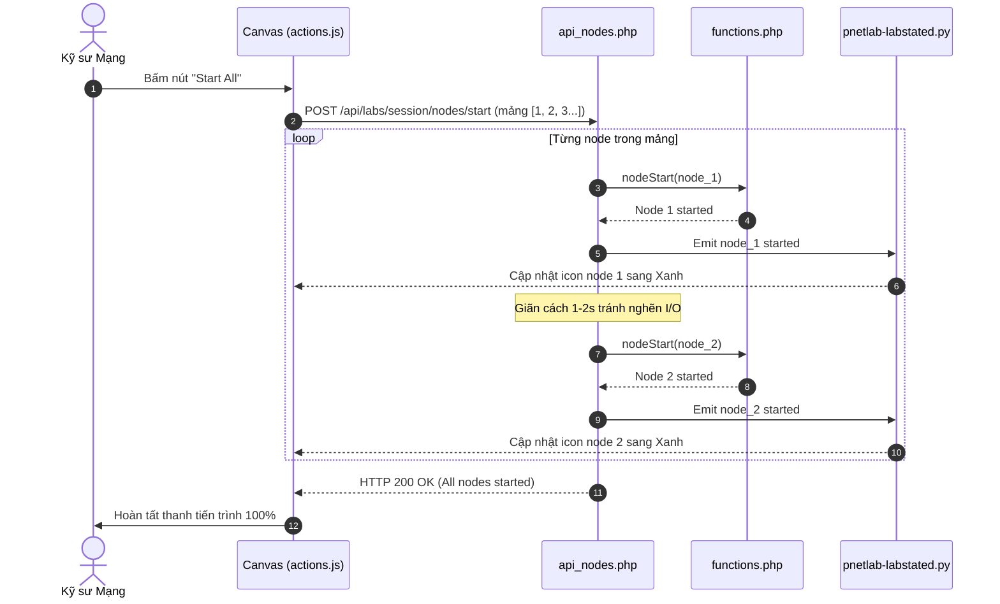

# SƠ ĐỒ TRÌNH TỰ (SEQUENCE DIAGRAM): F07 - BULK OPERATIONS

```mermaid
sequenceDiagram
    autonumber
    actor User as Kỹ sư Mạng
    participant UI as Canvas (actions.js)
    participant API as api_nodes.php
    participant Func as functions.php
    participant SSE as pnetlab-labstated.py

    User->>UI: Bấm nút "Start All"
    UI->>API: POST /api/labs/session/nodes/start (mảng [1, 2, 3...])
    loop Từng node trong mảng
        API->>Func: nodeStart(node_1)
        Func-->>API: Node 1 started
        API->>SSE: Emit node_1 started
        SSE-->>UI: Cập nhật icon node 1 sang Xanh
        Note over API: Giãn cách 1-2s tránh nghẽn I/O
        API->>Func: nodeStart(node_2)
        Func-->>API: Node 2 started
        API->>SSE: Emit node_2 started
        SSE-->>UI: Cập nhật icon node 2 sang Xanh
    end
    API-->>UI: HTTP 200 OK (All nodes started)
    UI->>User: Hoàn tất thanh tiến trình 100%
```
