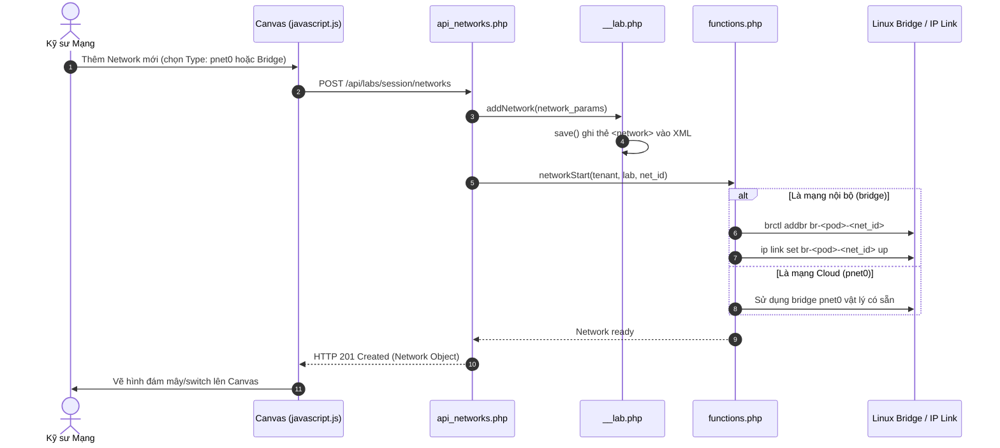

# SƠ ĐỒ TRÌNH TỰ (SEQUENCE DIAGRAM): F08 - BRIDGE & CLOUD NETWORKS

```mermaid
sequenceDiagram
    autonumber
    actor User as Kỹ sư Mạng
    participant UI as Canvas (javascript.js)
    participant API as api_networks.php
    participant LabModel as __lab.php
    participant Func as functions.php
    participant Kernel as Linux Bridge / IP Link

    User->>UI: Thêm Network mới (chọn Type: pnet0 hoặc Bridge)
    UI->>API: POST /api/labs/session/networks
    API->>LabModel: addNetwork(network_params)
    LabModel->>LabModel: save() ghi thẻ <network> vào XML
    API->>Func: networkStart(tenant, lab, net_id)
    alt Là mạng nội bộ (bridge)
        Func->>Kernel: brctl addbr br-<pod>-<net_id>
        Func->>Kernel: ip link set br-<pod>-<net_id> up
    else Là mạng Cloud (pnet0)
        Func->>Kernel: Sử dụng bridge pnet0 vật lý có sẵn
    end
    Func-->>API: Network ready
    API-->>UI: HTTP 201 Created (Network Object)
    UI->>User: Vẽ hình đám mây/switch lên Canvas
```
