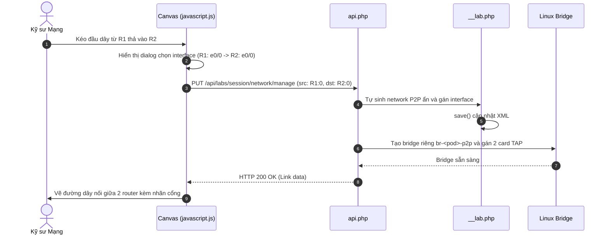

# SƠ ĐỒ TRÌNH TỰ (SEQUENCE DIAGRAM): F09 - POINT-TO-POINT LINKS

```mermaid
sequenceDiagram
    autonumber
    actor User as Kỹ sư Mạng
    participant UI as Canvas (javascript.js)
    participant API as api.php
    participant LabModel as __lab.php
    participant Kernel as Linux Bridge

    User->>UI: Kéo đầu dây từ R1 thả vào R2
    UI->>UI: Hiển thị dialog chọn interface (R1: e0/0 -> R2: e0/0)
    UI->>API: PUT /api/labs/session/network/manage (src: R1:0, dst: R2:0)
    API->>LabModel: Tự sinh network P2P ẩn và gán interface
    LabModel->>LabModel: save() cập nhật XML
    API->>Kernel: Tạo bridge riêng br-<pod>-p2p và gán 2 card TAP
    Kernel-->>API: Bridge sẵn sàng
    API-->>UI: HTTP 200 OK (Link data)
    UI->>User: Vẽ đường dây nối giữa 2 router kèm nhãn cổng
```
