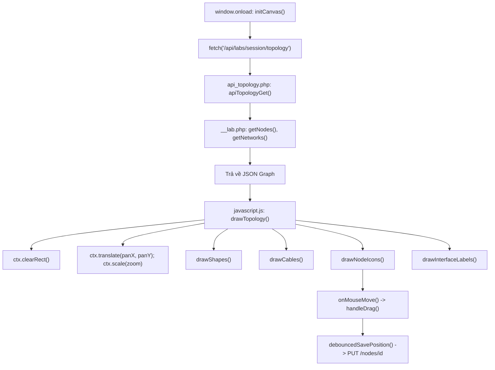

# SƠ ĐỒ GỌI HÀM (CALL GRAPH): F10 - CANVAS TOPOLOGY ENGINE

```mermaid
graph TD
    INIT["window.onload: initCanvas()"] --> FETCH_TOPO["fetch('/api/labs/session/topology')"]
    FETCH_TOPO --> API_TOPO["api_topology.php: apiTopologyGet()"]
    API_TOPO --> LOAD_ELEMENTS["__lab.php: getNodes(), getNetworks()"]
    LOAD_ELEMENTS --> RETURN_JSON["Trả về JSON Graph"]
    RETURN_JSON --> RENDER_LOOP["javascript.js: drawTopology()"]
    RENDER_LOOP --> CLEAR["ctx.clearRect()"]
    RENDER_LOOP --> APPLY_TRANSFORM["ctx.translate(panX, panY); ctx.scale(zoom)"]
    RENDER_LOOP --> DRAW_SHAPES["drawShapes()"]
    RENDER_LOOP --> DRAW_LINKS["drawCables()"]
    RENDER_LOOP --> DRAW_NODES["drawNodeIcons()"]
    RENDER_LOOP --> DRAW_LABELS["drawInterfaceLabels()"]
    DRAW_NODES --> EVENT_DRAG["onMouseMove() -> handleDrag()"]
    EVENT_DRAG --> SAVE_POS["debouncedSavePosition() -> PUT /nodes/id"]
```
