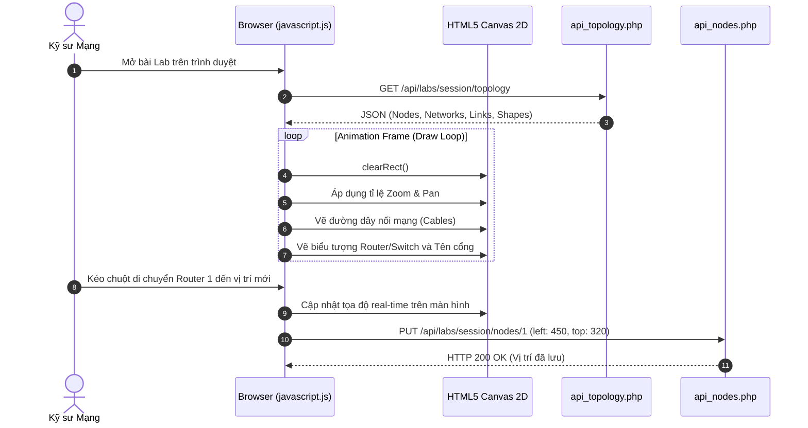

# SƠ ĐỒ TRÌNH TỰ (SEQUENCE DIAGRAM): F10 - CANVAS TOPOLOGY ENGINE

```mermaid
sequenceDiagram
    autonumber
    actor User as Kỹ sư Mạng
    participant UI as Browser (javascript.js)
    participant Canvas as HTML5 Canvas 2D
    participant API as api_topology.php
    participant NodeAPI as api_nodes.php

    User->>UI: Mở bài Lab trên trình duyệt
    UI->>API: GET /api/labs/session/topology
    API-->>UI: JSON (Nodes, Networks, Links, Shapes)
    loop Animation Frame (Draw Loop)
        UI->>Canvas: clearRect()
        UI->>Canvas: Áp dụng tỉ lệ Zoom & Pan
        UI->>Canvas: Vẽ đường dây nối mạng (Cables)
        UI->>Canvas: Vẽ biểu tượng Router/Switch và Tên cổng
    end
    User->>UI: Kéo chuột di chuyển Router 1 đến vị trí mới
    UI->>Canvas: Cập nhật tọa độ real-time trên màn hình
    UI->>NodeAPI: PUT /api/labs/session/nodes/1 (left: 450, top: 320)
    NodeAPI-->>UI: HTTP 200 OK (Vị trí đã lưu)
```
