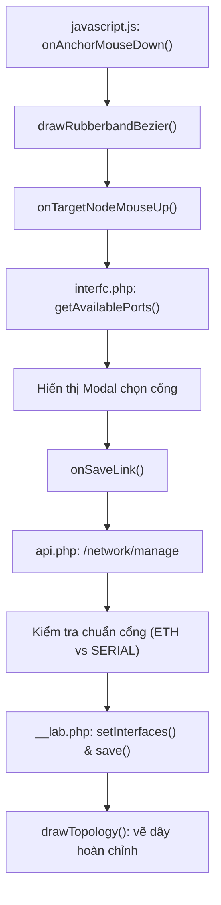

# SƠ ĐỒ GỌI HÀM (CALL GRAPH): F11 - CANVAS LINK DRAWING

```mermaid
graph TD
    MOUSE_DRAG["javascript.js: onAnchorMouseDown()"] --> DRAW_CURVE["drawRubberbandBezier()"]
    DRAW_CURVE --> MOUSE_UP["onTargetNodeMouseUp()"]
    MOUSE_UP --> FETCH_PORTS["interfc.php: getAvailablePorts()"]
    FETCH_PORTS --> SHOW_MODAL["Hiển thị Modal chọn cổng"]
    SHOW_MODAL --> SUBMIT["onSaveLink()"]
    SUBMIT --> PUT_API["api.php: /network/manage"]
    PUT_API --> VALIDATE_COMPAT["Kiểm tra chuẩn cổng (ETH vs SERIAL)"]
    VALIDATE_COMPAT --> SAVE_XML["__lab.php: setInterfaces() & save()"]
    SAVE_XML --> REFRESH_CANVAS["drawTopology(): vẽ dây hoàn chỉnh"]
```
