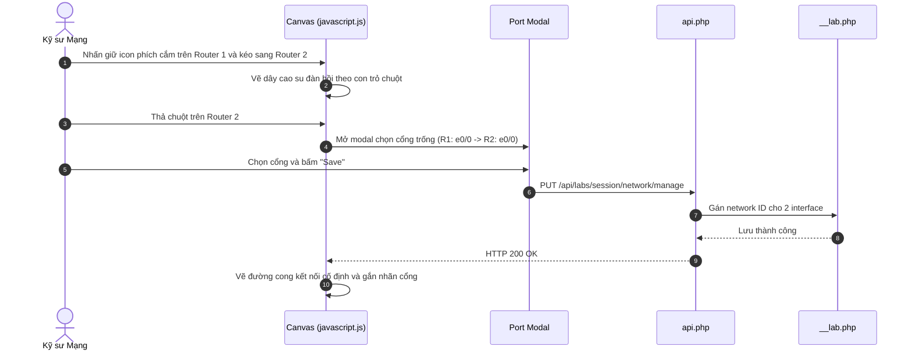

# SƠ ĐỒ TRÌNH TỰ (SEQUENCE DIAGRAM): F11 - CANVAS LINK DRAWING

```mermaid
sequenceDiagram
    autonumber
    actor User as Kỹ sư Mạng
    participant UI as Canvas (javascript.js)
    participant Modal as Port Modal
    participant API as api.php
    participant LabModel as __lab.php

    User->>UI: Nhấn giữ icon phích cắm trên Router 1 và kéo sang Router 2
    UI->>UI: Vẽ dây cao su đàn hồi theo con trỏ chuột
    User->>UI: Thả chuột trên Router 2
    UI->>Modal: Mở modal chọn cổng trống (R1: e0/0 -> R2: e0/0)
    User->>Modal: Chọn cổng và bấm "Save"
    Modal->>API: PUT /api/labs/session/network/manage
    API->>LabModel: Gán network ID cho 2 interface
    LabModel-->>API: Lưu thành công
    API-->>UI: HTTP 200 OK
    UI->>UI: Vẽ đường cong kết nối cố định và gắn nhãn cổng
```
