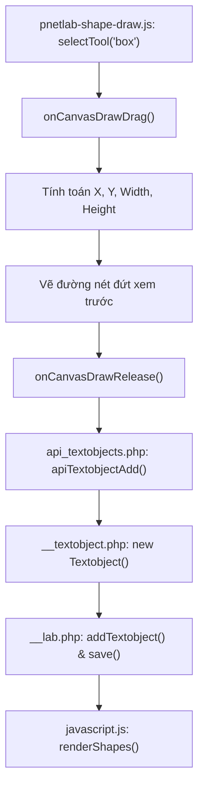

# SƠ ĐỒ GỌI HÀM (CALL GRAPH): F12 - SHAPES & ANNOTATIONS

```mermaid
graph TD
    TOOL_SELECT["pnetlab-shape-draw.js: selectTool('box')"] --> MOUSE_DRAG["onCanvasDrawDrag()"]
    MOUSE_DRAG --> CALC_DIMS["Tính toán X, Y, Width, Height"]
    CALC_DIMS --> PREVIEW["Vẽ đường nét đứt xem trước"]
    PREVIEW --> MOUSE_UP["onCanvasDrawRelease()"]
    MOUSE_UP --> POST_API["api_textobjects.php: apiTextobjectAdd()"]
    POST_API --> MODEL["__textobject.php: new Textobject()"]
    MODEL --> SAVE_XML["__lab.php: addTextobject() & save()"]
    SAVE_XML --> RENDER["javascript.js: renderShapes()"]
```
