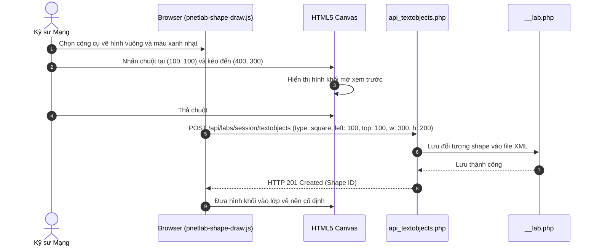

# SƠ ĐỒ TRÌNH TỰ (SEQUENCE DIAGRAM): F12 - SHAPES & ANNOTATIONS

```mermaid
sequenceDiagram
    autonumber
    actor User as Kỹ sư Mạng
    participant UI as Browser (pnetlab-shape-draw.js)
    participant Canvas as HTML5 Canvas
    participant API as api_textobjects.php
    participant LabModel as __lab.php

    User->>UI: Chọn công cụ vẽ hình vuông và màu xanh nhạt
    User->>Canvas: Nhấn chuột tại (100, 100) và kéo đến (400, 300)
    Canvas->>Canvas: Hiển thị hình khối mờ xem trước
    User->>Canvas: Thả chuột
    UI->>API: POST /api/labs/session/textobjects (type: square, left: 100, top: 100, w: 300, h: 200)
    API->>LabModel: Lưu đối tượng shape vào file XML
    LabModel-->>API: Lưu thành công
    API-->>UI: HTTP 201 Created (Shape ID)
    UI->>Canvas: Đưa hình khối vào lớp vẽ nền cố định
```
