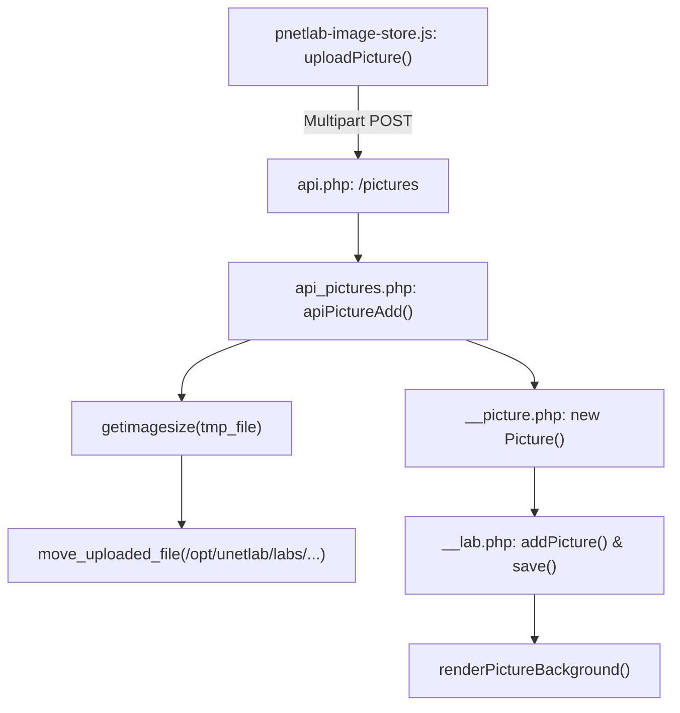

# SƠ ĐỒ GỌI HÀM (CALL GRAPH): F13 - CUSTOM PICTURES & MAPS

```mermaid
graph TD
    UI["pnetlab-image-store.js: uploadPicture()"] -->|Multipart POST| API["api.php: /pictures"]
    API --> CONTROLLER["api_pictures.php: apiPictureAdd()"]
    CONTROLLER --> CHECK_IMG["getimagesize(tmp_file)"]
    CHECK_IMG --> SAVE_DISK["move_uploaded_file(/opt/unetlab/labs/...)"]
    CONTROLLER --> MODEL["__picture.php: new Picture()"]
    MODEL --> SAVE_XML["__lab.php: addPicture() & save()"]
    SAVE_XML --> CLIENT_RENDER["renderPictureBackground()"]
```
