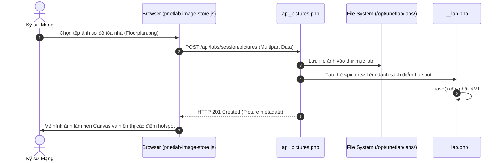

# SƠ ĐỒ TRÌNH TỰ (SEQUENCE DIAGRAM): F13 - CUSTOM PICTURES & MAPS

```mermaid
sequenceDiagram
    autonumber
    actor User as Kỹ sư Mạng
    participant UI as Browser (pnetlab-image-store.js)
    participant API as api_pictures.php
    participant Storage as File System (/opt/unetlab/labs/)
    participant LabModel as __lab.php

    User->>UI: Chọn tệp ảnh sơ đồ tòa nhà (Floorplan.png)
    UI->>API: POST /api/labs/session/pictures (Multipart Data)
    API->>Storage: Lưu file ảnh vào thư mục lab
    API->>LabModel: Tạo thẻ <picture> kèm danh sách điểm hotspot
    LabModel->>LabModel: save() cập nhật XML
    API-->>UI: HTTP 201 Created (Picture metadata)
    UI->>User: Vẽ hình ảnh làm nền Canvas và hiển thị các điểm hotspot
```
