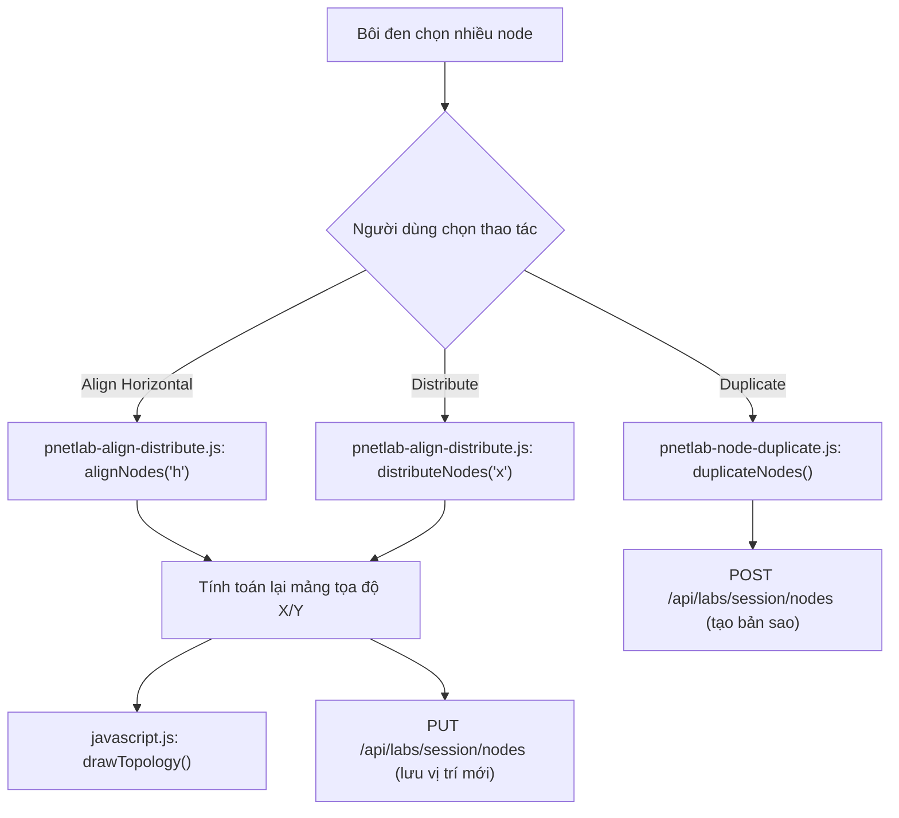

# SƠ ĐỒ GỌI HÀM (CALL GRAPH): F14 - ALIGNMENT & DUPLICATION

```mermaid
graph TD
    SELECT["Bôi đen chọn nhiều node"] --> ACTION{"Người dùng chọn thao tác"}
    ACTION -- Align Horizontal --> ALIGN_H["pnetlab-align-distribute.js: alignNodes('h')"]
    ACTION -- Distribute --> DIST["pnetlab-align-distribute.js: distributeNodes('x')"]
    ACTION -- Duplicate --> DUP["pnetlab-node-duplicate.js: duplicateNodes()"]
    ALIGN_H --> CALC_POS["Tính toán lại mảng tọa độ X/Y"]
    DIST --> CALC_POS
    CALC_POS --> REDRAW["javascript.js: drawTopology()"]
    CALC_POS --> SYNC_API["PUT /api/labs/session/nodes (lưu vị trí mới)"]
    DUP --> CALL_ADD["POST /api/labs/session/nodes (tạo bản sao)"]
```
