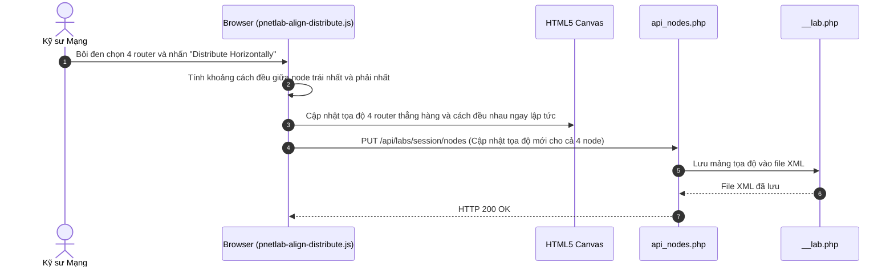

# SƠ ĐỒ TRÌNH TỰ (SEQUENCE DIAGRAM): F14 - ALIGNMENT & DUPLICATION

```mermaid
sequenceDiagram
    autonumber
    actor User as Kỹ sư Mạng
    participant UI as Browser (pnetlab-align-distribute.js)
    participant Canvas as HTML5 Canvas
    participant API as api_nodes.php
    participant LabModel as __lab.php

    User->>UI: Bôi đen chọn 4 router và nhấn "Distribute Horizontally"
    UI->>UI: Tính khoảng cách đều giữa node trái nhất và phải nhất
    UI->>Canvas: Cập nhật tọa độ 4 router thẳng hàng và cách đều nhau ngay lập tức
    UI->>API: PUT /api/labs/session/nodes (Cập nhật tọa độ mới cho cả 4 node)
    API->>LabModel: Lưu mảng tọa độ vào file XML
    LabModel-->>API: File XML đã lưu
    API-->>UI: HTTP 200 OK
```
