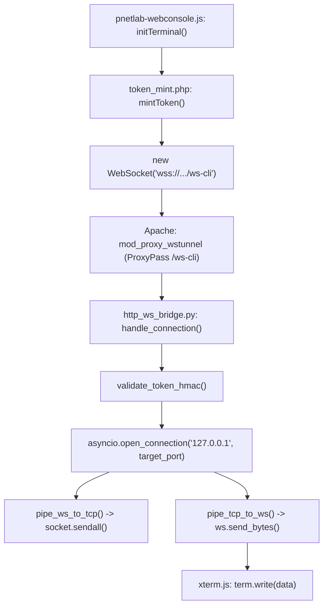

# SƠ ĐỒ GỌI HÀM (CALL GRAPH): F15 - WEBCONSOLE WEBSOCKET BRIDGE

```mermaid
graph TD
    BROWSER["pnetlab-webconsole.js: initTerminal()"] --> GET_TOKEN["token_mint.php: mintToken()"]
    GET_TOKEN --> WS_CONNECT["new WebSocket('wss://.../ws-cli')"]
    WS_CONNECT --> APACHE["Apache: mod_proxy_wstunnel (ProxyPass /ws-cli)"]
    APACHE --> PY_BRIDGE["http_ws_bridge.py: handle_connection()"]
    PY_BRIDGE --> VALIDATE_TOKEN["validate_token_hmac()"]
    VALIDATE_TOKEN --> OPEN_TCP["asyncio.open_connection('127.0.0.1', target_port)"]
    OPEN_TCP --> PIPE_IN["pipe_ws_to_tcp() -> socket.sendall()"]
    OPEN_TCP --> PIPE_OUT["pipe_tcp_to_ws() -> ws.send_bytes()"]
    PIPE_OUT --> XTERM["xterm.js: term.write(data)"]
```
