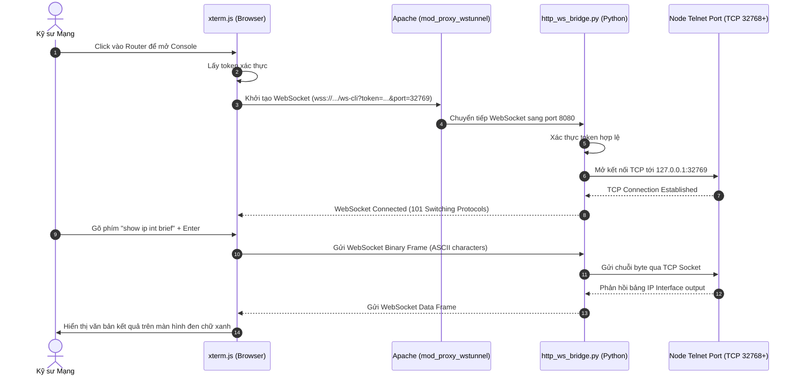

# SƠ ĐỒ TRÌNH TỰ (SEQUENCE DIAGRAM): F15 - WEBCONSOLE WEBSOCKET BRIDGE

```mermaid
sequenceDiagram
    autonumber
    actor User as Kỹ sư Mạng
    participant UI as xterm.js (Browser)
    participant Apache as Apache (mod_proxy_wstunnel)
    participant Bridge as http_ws_bridge.py (Python)
    participant Node as Node Telnet Port (TCP 32768+)

    User->>UI: Click vào Router để mở Console
    UI->>UI: Lấy token xác thực
    UI->>Apache: Khởi tạo WebSocket (wss://.../ws-cli?token=...&port=32769)
    Apache->>Bridge: Chuyển tiếp WebSocket sang port 8080
    Bridge->>Bridge: Xác thực token hợp lệ
    Bridge->>Node: Mở kết nối TCP tới 127.0.0.1:32769
    Node-->>Bridge: TCP Connection Established
    Bridge-->>UI: WebSocket Connected (101 Switching Protocols)
    User->>UI: Gõ phím "show ip int brief" + Enter
    UI->>Bridge: Gửi WebSocket Binary Frame (ASCII characters)
    Bridge->>Node: Gửi chuỗi byte qua TCP Socket
    Node-->>Bridge: Phản hồi bảng IP Interface output
    Bridge-->>UI: Gửi WebSocket Data Frame
    UI->>User: Hiển thị văn bản kết quả trên màn hình đen chữ xanh
```
