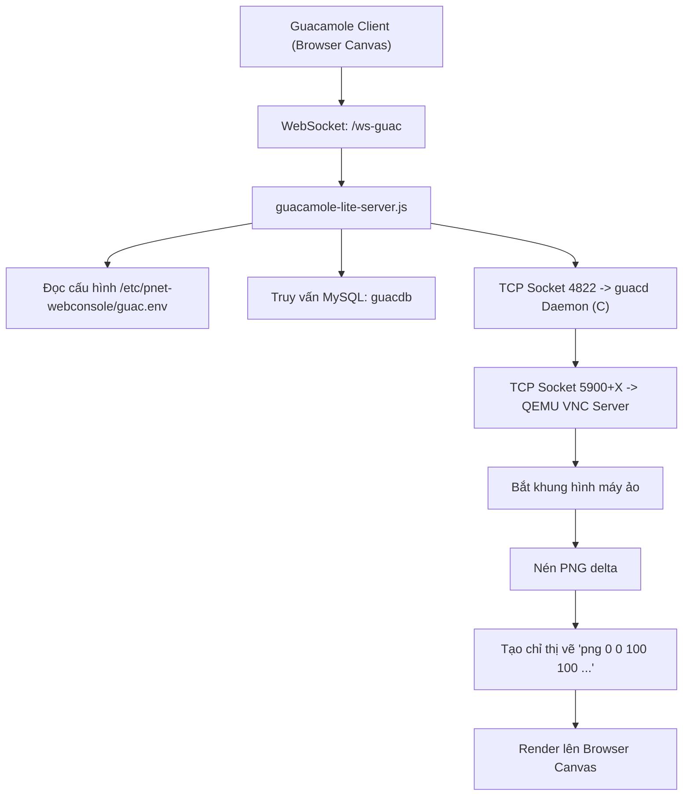

# SƠ ĐỒ GỌI HÀM (CALL GRAPH): F16 - GUACAMOLE VNC/RDP

```mermaid
graph TD
    UI["Guacamole Client (Browser Canvas)"] --> WS_GUAC["WebSocket: /ws-guac"]
    WS_GUAC --> NODE_SERVER["guacamole-lite-server.js"]
    NODE_SERVER --> READ_ENV["Đọc cấu hình /etc/pnet-webconsole/guac.env"]
    NODE_SERVER --> DB_GUAC["Truy vấn MySQL: guacdb"]
    NODE_SERVER --> GUACD_SOCK["TCP Socket 4822 -> guacd Daemon (C)"]
    GUACD_SOCK --> VNC_SOCK["TCP Socket 5900+X -> QEMU VNC Server"]
    VNC_SOCK --> FRAME_CAPTURE["Bắt khung hình máy ảo"]
    FRAME_CAPTURE --> ENCODE_PNG["Nén PNG delta"]
    ENCODE_PNG --> GUAC_INSTR["Tạo chỉ thị vẽ 'png 0 0 100 100 ...'"]
    GUAC_INSTR --> DRAW_CANVAS["Render lên Browser Canvas"]
```
