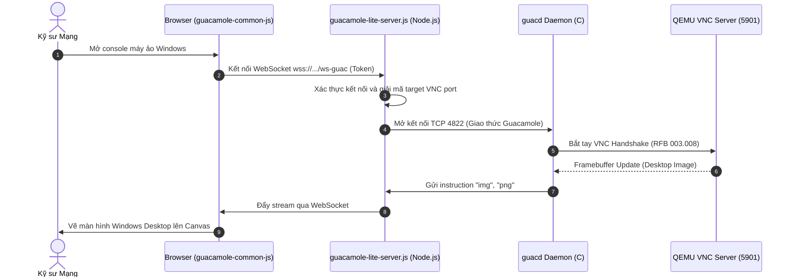

# SƠ ĐỒ TRÌNH TỰ (SEQUENCE DIAGRAM): F16 - GUACAMOLE VNC/RDP

```mermaid
sequenceDiagram
    autonumber
    actor User as Kỹ sư Mạng
    participant Browser as Browser (guacamole-common-js)
    participant GuacLite as guacamole-lite-server.js (Node.js)
    participant Guacd as guacd Daemon (C)
    participant Qemu as QEMU VNC Server (5901)

    User->>Browser: Mở console máy ảo Windows
    Browser->>GuacLite: Kết nối WebSocket wss://.../ws-guac (Token)
    GuacLite->>GuacLite: Xác thực kết nối và giải mã target VNC port
    GuacLite->>Guacd: Mở kết nối TCP 4822 (Giao thức Guacamole)
    Guacd->>Qemu: Bắt tay VNC Handshake (RFB 003.008)
    Qemu-->>Guacd: Framebuffer Update (Desktop Image)
    Guacd->>GuacLite: Gửi instruction "img", "png"
    GuacLite->>Browser: Đẩy stream qua WebSocket
    Browser->>User: Vẽ màn hình Windows Desktop lên Canvas
```
