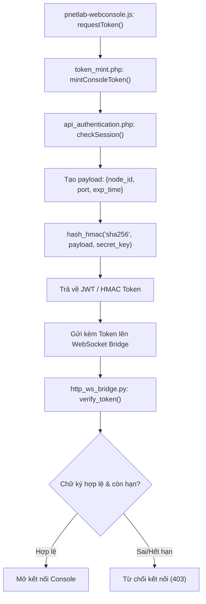

# SƠ ĐỒ GỌI HÀM (CALL GRAPH): F17 - CONSOLE TOKEN MINTING

```mermaid
graph TD
    CLIENT["pnetlab-webconsole.js: requestToken()"] --> POST_MINT["token_mint.php: mintConsoleToken()"]
    POST_MINT --> AUTH_CHECK["api_authentication.php: checkSession()"]
    AUTH_CHECK --> MAKE_PAYLOAD["Tạo payload: {node_id, port, exp_time}"]
    MAKE_PAYLOAD --> SIGN["hash_hmac('sha256', payload, secret_key)"]
    SIGN --> RETURN_TOKEN["Trả về JWT / HMAC Token"]
    RETURN_TOKEN --> WS_CONNECT["Gửi kèm Token lên WebSocket Bridge"]
    WS_CONNECT --> PY_VERIFY["http_ws_bridge.py: verify_token()"]
    PY_VERIFY --> CHECK_SIG{"Chữ ký hợp lệ & còn hạn?"}
    CHECK_SIG -- Hợp lệ --> ALLOW["Mở kết nối Console"]
    CHECK_SIG -- Sai/Hết hạn --> REJECT["Từ chối kết nối (403)"]
```
