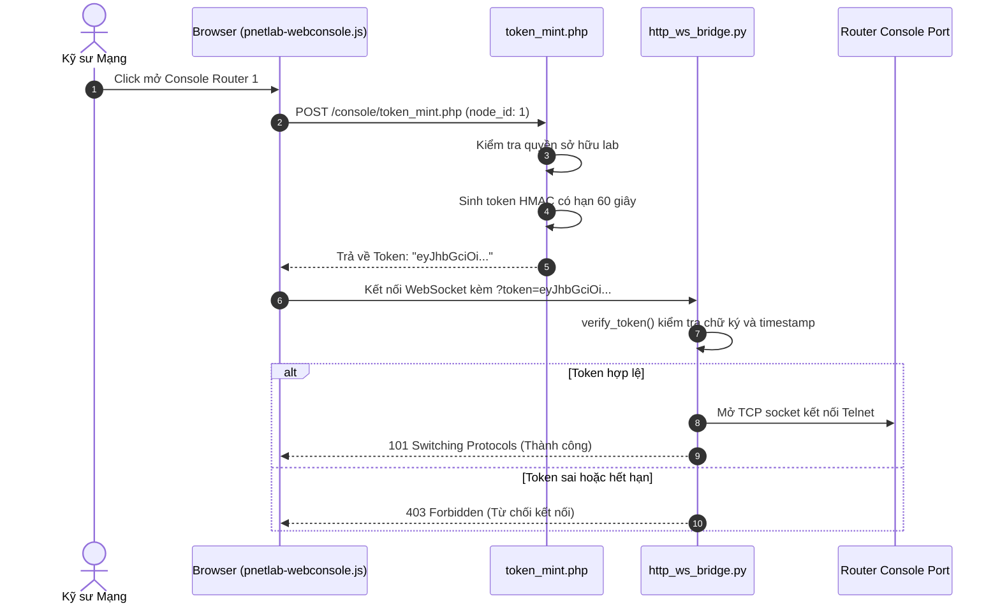

# SƠ ĐỒ TRÌNH TỰ (SEQUENCE DIAGRAM): F17 - CONSOLE TOKEN MINTING

```mermaid
sequenceDiagram
    autonumber
    actor User as Kỹ sư Mạng
    participant UI as Browser (pnetlab-webconsole.js)
    participant Mint as token_mint.php
    participant Bridge as http_ws_bridge.py
    participant Node as Router Console Port

    User->>UI: Click mở Console Router 1
    UI->>Mint: POST /console/token_mint.php (node_id: 1)
    Mint->>Mint: Kiểm tra quyền sở hữu lab
    Mint->>Mint: Sinh token HMAC có hạn 60 giây
    Mint-->>UI: Trả về Token: "eyJhbGciOi..."
    UI->>Bridge: Kết nối WebSocket kèm ?token=eyJhbGciOi...
    Bridge->>Bridge: verify_token() kiểm tra chữ ký và timestamp
    alt Token hợp lệ
        Bridge->>Node: Mở TCP socket kết nối Telnet
        Bridge-->>UI: 101 Switching Protocols (Thành công)
    else Token sai hoặc hết hạn
        Bridge-->>UI: 403 Forbidden (Từ chối kết nối)
    end
```
