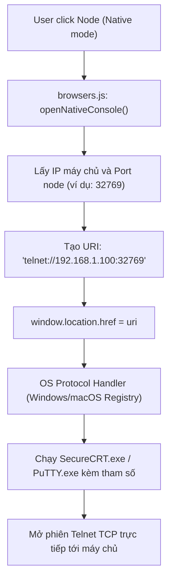

# SƠ ĐỒ GỌI HÀM (CALL GRAPH): F18 - NATIVE CONSOLE

```mermaid
graph TD
    CLICK["User click Node (Native mode)"] --> BROWSER_JS["browsers.js: openNativeConsole()"]
    BROWSER_JS --> GET_PORT["Lấy IP máy chủ và Port node (ví dụ: 32769)"]
    GET_PORT --> BUILD_URI["Tạo URI: 'telnet://192.168.1.100:32769'"]
    BUILD_URI --> WINDOW_OPEN["window.location.href = uri"]
    WINDOW_OPEN --> OS_HANDLER["OS Protocol Handler (Windows/macOS Registry)"]
    OS_HANDLER --> LAUNCH_APP["Chạy SecureCRT.exe / PuTTY.exe kèm tham số"]
    LAUNCH_APP --> TCP_DIRECT["Mở phiên Telnet TCP trực tiếp tới máy chủ"]
```
