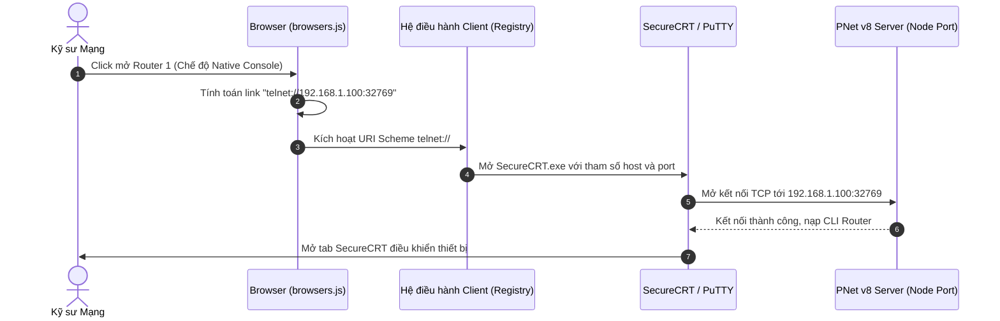

# SƠ ĐỒ TRÌNH TỰ (SEQUENCE DIAGRAM): F18 - NATIVE CONSOLE

```mermaid
sequenceDiagram
    autonumber
    actor User as Kỹ sư Mạng
    participant Canvas as Browser (browsers.js)
    participant OS as Hệ điều hành Client (Registry)
    participant App as SecureCRT / PuTTY
    participant Server as PNet v8 Server (Node Port)

    User->>Canvas: Click mở Router 1 (Chế độ Native Console)
    Canvas->>Canvas: Tính toán link "telnet://192.168.1.100:32769"
    Canvas->>OS: Kích hoạt URI Scheme telnet://
    OS->>App: Mở SecureCRT.exe với tham số host và port
    App->>Server: Mở kết nối TCP tới 192.168.1.100:32769
    Server-->>App: Kết nối thành công, nạp CLI Router
    App->>User: Mở tab SecureCRT điều khiển thiết bị
```
