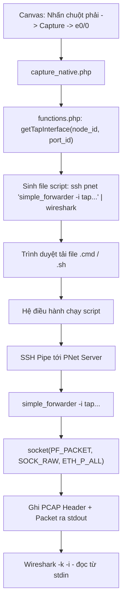

# SƠ ĐỒ GỌI HÀM (CALL GRAPH): F19 - REMOTE WIRESHARK CAPTURE

```mermaid
graph TD
    CLICK_CAP["Canvas: Nhấn chuột phải -> Capture -> e0/0"] --> CAPTURE_API["capture_native.php"]
    CAPTURE_API --> RESOLVE_TAP["functions.php: getTapInterface(node_id, port_id)"]
    RESOLVE_TAP --> GEN_SCRIPT["Sinh file script: ssh pnet 'simple_forwarder -i tap...' | wireshark"]
    GEN_SCRIPT --> DOWNLOAD["Trình duyệt tải file .cmd / .sh"]
    DOWNLOAD --> RUN_LOCAL["Hệ điều hành chạy script"]
    RUN_LOCAL --> SSH_TUNNEL["SSH Pipe tới PNet Server"]
    SSH_TUNNEL --> EXEC_FWD["simple_forwarder -i tap..."]
    EXEC_FWD --> RAW_SOCK["socket(PF_PACKET, SOCK_RAW, ETH_P_ALL)"]
    RAW_SOCK --> WRITE_STDOUT["Ghi PCAP Header + Packet ra stdout"]
    WRITE_STDOUT --> WS_PIPE["Wireshark -k -i - đọc từ stdin"]
```
