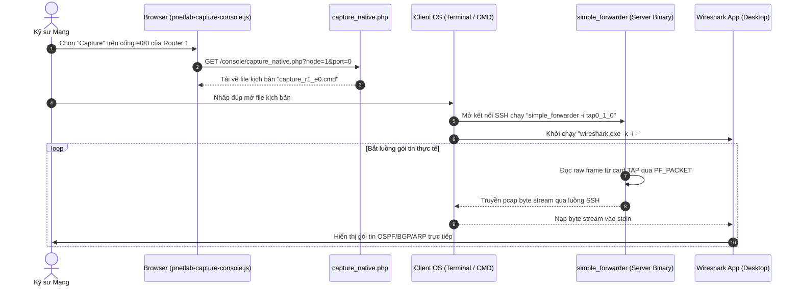

# SƠ ĐỒ TRÌNH TỰ (SEQUENCE DIAGRAM): F19 - REMOTE WIRESHARK CAPTURE

```mermaid
sequenceDiagram
    autonumber
    actor User as Kỹ sư Mạng
    participant Canvas as Browser (pnetlab-capture-console.js)
    participant API as capture_native.php
    participant LocalOS as Client OS (Terminal / CMD)
    participant Fwd as simple_forwarder (Server Binary)
    participant Wireshark as Wireshark App (Desktop)

    User->>Canvas: Chọn "Capture" trên cổng e0/0 của Router 1
    Canvas->>API: GET /console/capture_native.php?node=1&port=0
    API-->>Canvas: Tải về file kịch bản "capture_r1_e0.cmd"
    User->>LocalOS: Nhấp đúp mở file kịch bản
    LocalOS->>Fwd: Mở kết nối SSH chạy "simple_forwarder -i tap0_1_0"
    LocalOS->>Wireshark: Khởi chạy "wireshark.exe -k -i -"
    loop Bắt luồng gói tin thực tế
        Fwd->>Fwd: Đọc raw frame từ card TAP qua PF_PACKET
        Fwd-->>LocalOS: Truyền pcap byte stream qua luồng SSH
        LocalOS-->>Wireshark: Nạp byte stream vào stdin
        Wireshark->>User: Hiển thị gói tin OSPF/BGP/ARP trực tiếp
    end
```
