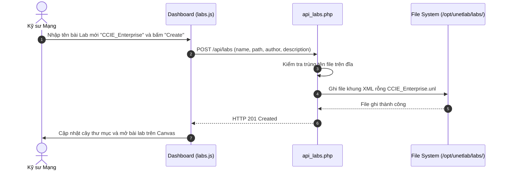

# SƠ ĐỒ TRÌNH TỰ (SEQUENCE DIAGRAM): F20 - LAB & FOLDER CRUD

```mermaid
sequenceDiagram
    autonumber
    actor User as Kỹ sư Mạng
    participant UI as Dashboard (labs.js)
    participant API as api_labs.php
    participant Storage as File System (/opt/unetlab/labs/)

    User->>UI: Nhập tên bài Lab mới "CCIE_Enterprise" và bấm "Create"
    UI->>API: POST /api/labs (name, path, author, description)
    API->>API: Kiểm tra trùng tên file trên đĩa
    API->>Storage: Ghi file khung XML rỗng CCIE_Enterprise.unl
    Storage-->>API: File ghi thành công
    API-->>UI: HTTP 201 Created
    UI->>User: Cập nhật cây thư mục và mở bài lab trên Canvas
```
