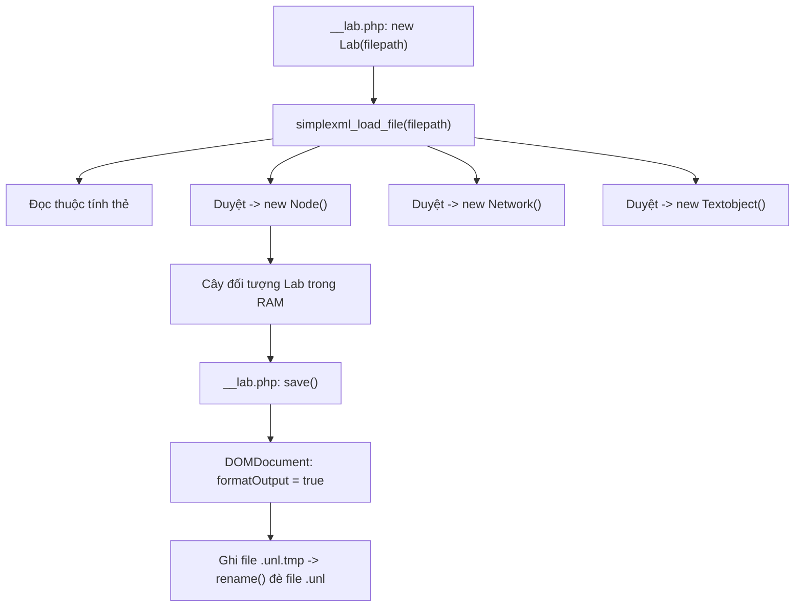

# SƠ ĐỒ GỌI HÀM (CALL GRAPH): F21 - XML PARSER & SERIALIZER

```mermaid
graph TD
    NEW_LAB["__lab.php: new Lab(filepath)"] --> LOAD_XML["simplexml_load_file(filepath)"]
    LOAD_XML --> PARSE_ATTRS["Đọc thuộc tính thẻ <lab>"]
    LOAD_XML --> LOOP_NODES["Duyệt <nodes> -> new Node()"]
    LOAD_XML --> LOOP_NETS["Duyệt <networks> -> new Network()"]
    LOAD_XML --> LOOP_TEXTS["Duyệt <textobjects> -> new Textobject()"]
    LOOP_NODES --> OBJECT_TREE["Cây đối tượng Lab trong RAM"]
    OBJECT_TREE --> SAVE["__lab.php: save()"]
    SAVE --> BUILD_DOM["DOMDocument: formatOutput = true"]
    BUILD_DOM --> ATOMIC_WRITE["Ghi file .unl.tmp -> rename() đè file .unl"]
```
