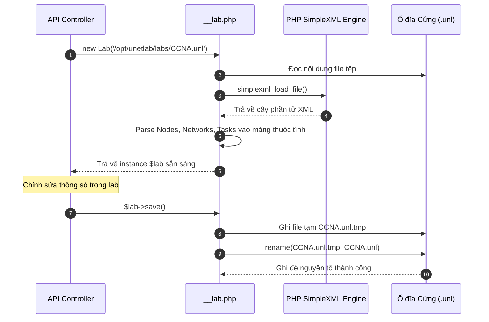

# SƠ ĐỒ TRÌNH TỰ (SEQUENCE DIAGRAM): F21 - XML PARSER & SERIALIZER

```mermaid
sequenceDiagram
    autonumber
    participant App as API Controller
    participant LabModel as __lab.php
    participant SimpleXML as PHP SimpleXML Engine
    participant Storage as Ổ đĩa Cứng (.unl)

    App->>LabModel: new Lab('/opt/unetlab/labs/CCNA.unl')
    LabModel->>Storage: Đọc nội dung file tệp
    LabModel->>SimpleXML: simplexml_load_file()
    SimpleXML-->>LabModel: Trả về cây phần tử XML
    LabModel->>LabModel: Parse Nodes, Networks, Tasks vào mảng thuộc tính
    LabModel-->>App: Trả về instance $lab sẵn sàng
    Note over App: Chỉnh sửa thông số trong lab
    App->>LabModel: $lab->save()
    LabModel->>Storage: Ghi file tạm CCNA.unl.tmp
    LabModel->>Storage: rename(CCNA.unl.tmp, CCNA.unl)
    Storage-->>LabModel: Ghi đè nguyên tố thành công
```
