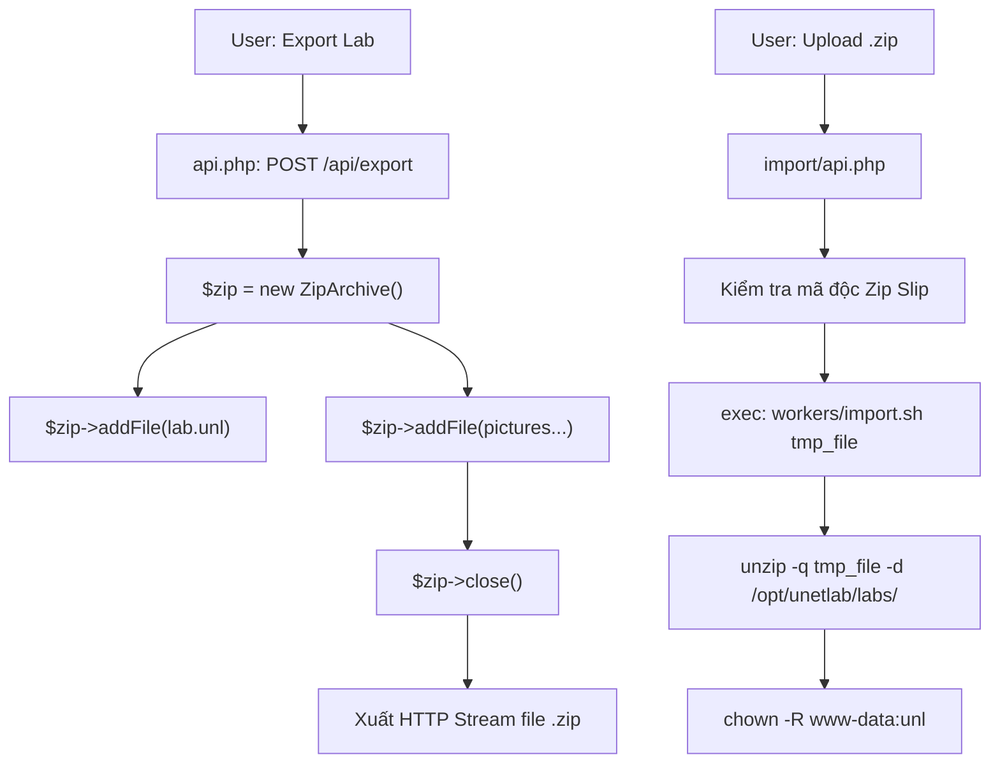

# SƠ ĐỒ GỌI HÀM (CALL GRAPH): F22 - ZIP EXPORT & IMPORT

```mermaid
graph TD
    EXPORT_CLICK["User: Export Lab"] --> POST_EXP["api.php: POST /api/export"]
    POST_EXP --> ZIP_NEW["$zip = new ZipArchive()"]
    ZIP_NEW --> ADD_UNL["$zip->addFile(lab.unl)"]
    ZIP_NEW --> ADD_IMGS["$zip->addFile(pictures...)"]
    ADD_IMGS --> ZIP_CLOSE["$zip->close()"]
    ZIP_CLOSE --> DOWNLOAD_STREAM["Xuất HTTP Stream file .zip"]
    
    IMPORT_UPLOAD["User: Upload .zip"] --> POST_IMP["import/api.php"]
    POST_IMP --> SANITIZE_ZIP["Kiểm tra mã độc Zip Slip"]
    SANITIZE_ZIP --> RUN_WORKER["exec: workers/import.sh tmp_file"]
    RUN_WORKER --> UNZIP["unzip -q tmp_file -d /opt/unetlab/labs/"]
    UNZIP --> FIX_PERM["chown -R www-data:unl"]
```
