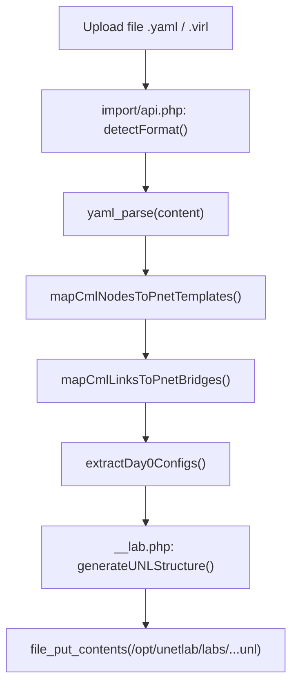

# SƠ ĐỒ GỌI HÀM (CALL GRAPH): F23 - CML / VIRL CONVERTER

```mermaid
graph TD
    UPLOAD["Upload file .yaml / .virl"] --> DETECT["import/api.php: detectFormat()"]
    DETECT --> PARSE_YAML["yaml_parse(content)"]
    PARSE_YAML --> MAP_NODES["mapCmlNodesToPnetTemplates()"]
    MAP_NODES --> MAP_LINKS["mapCmlLinksToPnetBridges()"]
    MAP_LINKS --> EXTRACT_CONF["extractDay0Configs()"]
    EXTRACT_CONF --> GEN_UNL["__lab.php: generateUNLStructure()"]
    GEN_UNL --> SAVE_DISK["file_put_contents(/opt/unetlab/labs/...unl)"]
```
