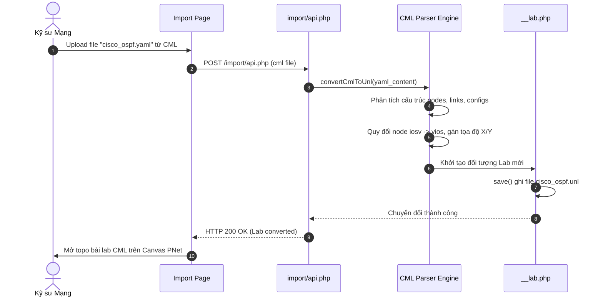

# SƠ ĐỒ TRÌNH TỰ (SEQUENCE DIAGRAM): F23 - CML / VIRL CONVERTER

```mermaid
sequenceDiagram
    autonumber
    actor User as Kỹ sư Mạng
    participant UI as Import Page
    participant API as import/api.php
    participant Converter as CML Parser Engine
    participant LabModel as __lab.php

    User->>UI: Upload file "cisco_ospf.yaml" từ CML
    UI->>API: POST /import/api.php (cml file)
    API->>Converter: convertCmlToUnl(yaml_content)
    Converter->>Converter: Phân tích cấu trúc nodes, links, configs
    Converter->>Converter: Quy đổi node iosv -> vios, gán tọa độ X/Y
    Converter->>LabModel: Khởi tạo đối tượng Lab mới
    LabModel->>LabModel: save() ghi file cisco_ospf.unl
    LabModel-->>API: Chuyển đổi thành công
    API-->>UI: HTTP 200 OK (Lab converted)
    UI->>User: Mở topo bài lab CML trên Canvas PNet
```
