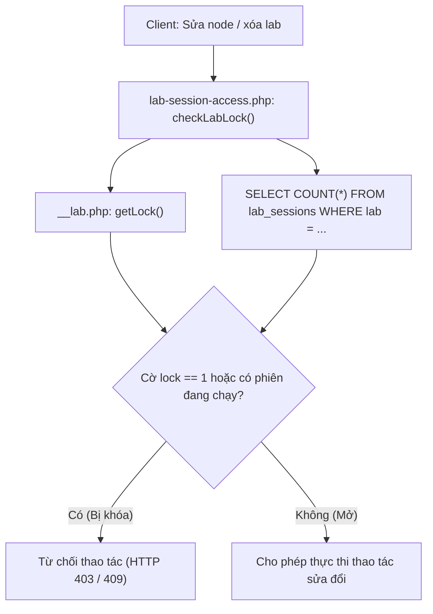

# SƠ ĐỒ GỌI HÀM (CALL GRAPH): F24 - LAB SESSION LOCKING

```mermaid
graph TD
    REQ_EDIT["Client: Sửa node / xóa lab"] --> CHECK_LOCK["lab-session-access.php: checkLabLock()"]
    CHECK_LOCK --> READ_XML["__lab.php: getLock()"]
    CHECK_LOCK --> QUERY_DB["SELECT COUNT(*) FROM lab_sessions WHERE lab = ..."]
    READ_XML --> DECISION{"Cờ lock == 1 hoặc có phiên đang chạy?"}
    QUERY_DB --> DECISION
    DECISION -- Có (Bị khóa) --> REJECT["Từ chối thao tác (HTTP 403 / 409)"]
    DECISION -- Không (Mở) --> ALLOW["Cho phép thực thi thao tác sửa đổi"]
```
